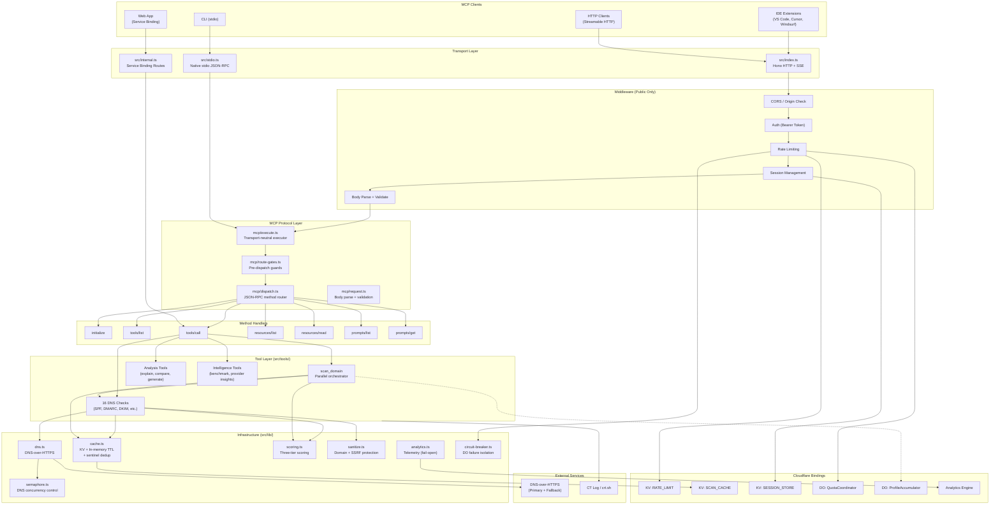
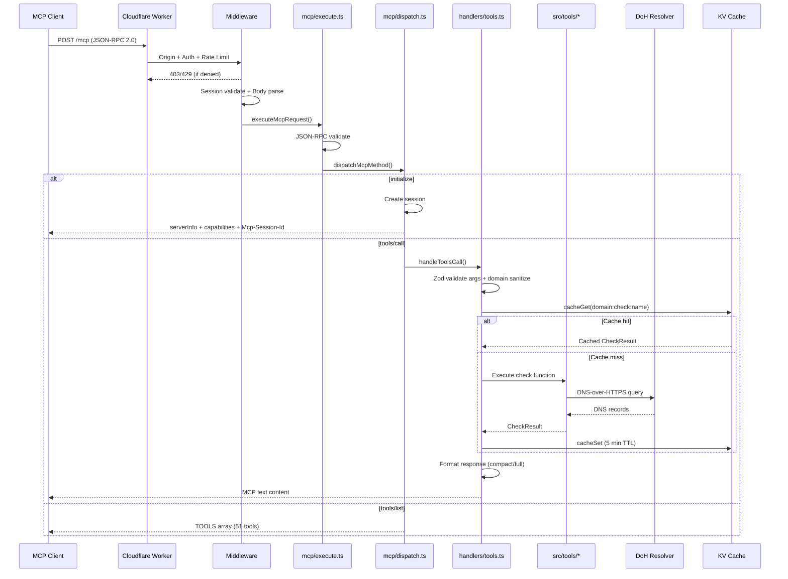
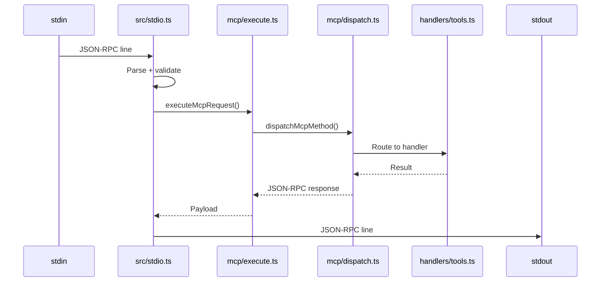
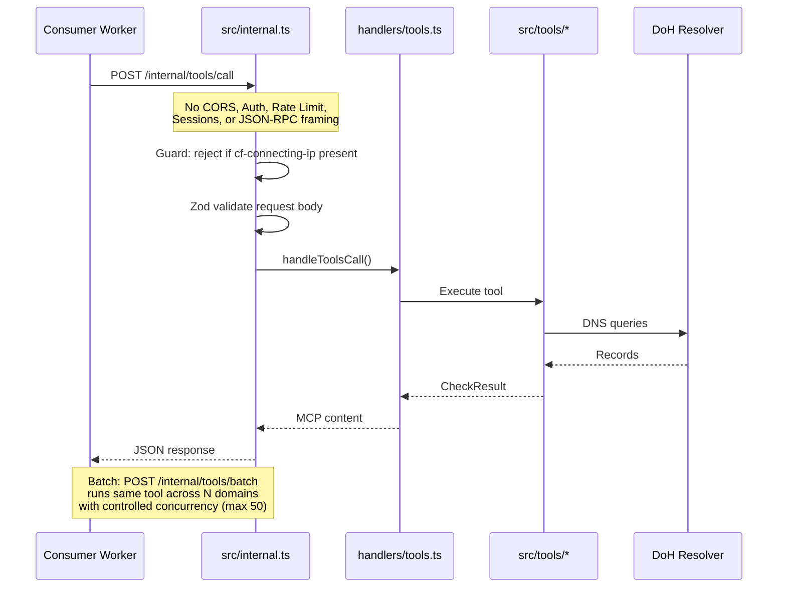
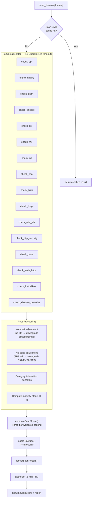
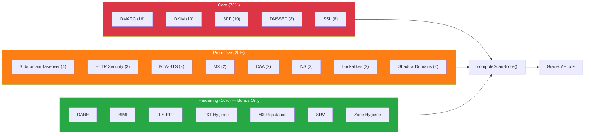
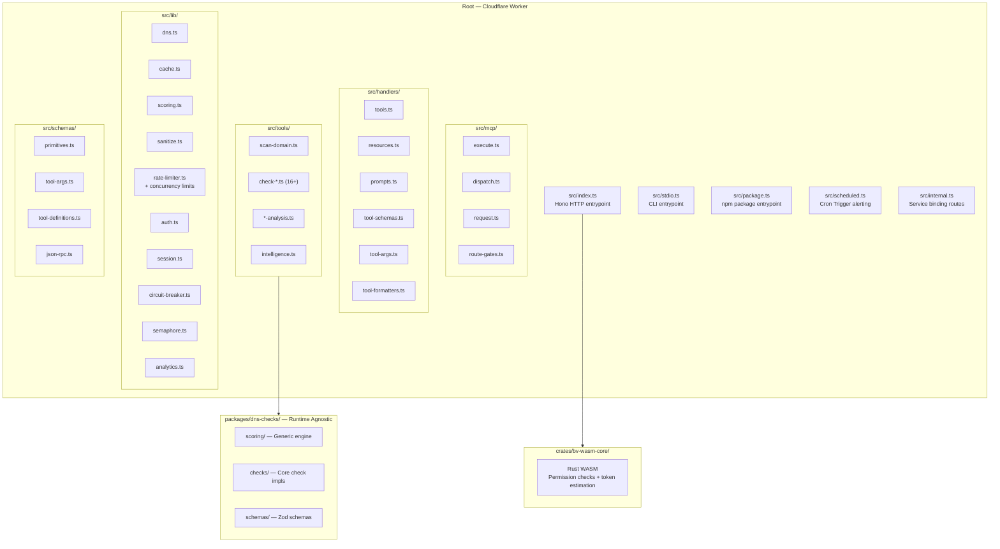
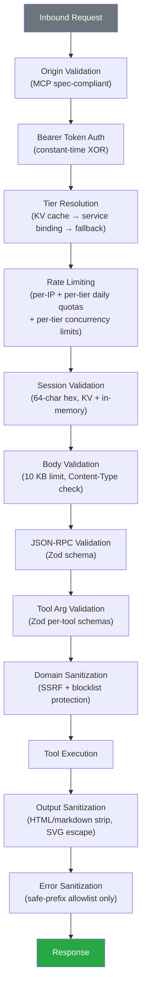

# Architecture Diagrams

> Auto-generated reference for AI agents and contributors.
> All PII, secrets, and internal infrastructure details have been stripped.

## System Overview

## Request Flow — Streamable HTTP

## Request Flow — Native stdio (CLI)

## Request Flow — Internal Service Binding

## scan_domain Orchestration

## Scoring Model

## Monorepo Structure

## Security Layers

