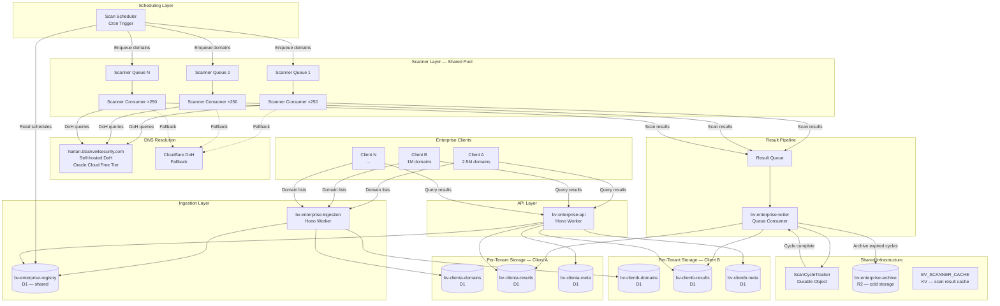

# Enterprise Batch Scanning Architecture

## 1. Executive Summary

Blackveil DNS Enterprise is a batch scanning pipeline built as a set of Cloudflare Workers that imports the existing `scanDomain()` function from the open-source MCP server and scales it to process up to **50 million domains** across multiple enterprise tenants. The architecture uses a **shared scanner queue pool** for compute efficiency with **fully isolated per-tenant D1 databases** for data security. DNS resolution is routed through a self-hosted DoH endpoint (`harlan.blackveilsecurity.com`) to eliminate public resolver rate limits, with automatic fallback to Cloudflare DoH. A single tenant scanning 2.5M domains completes in under 4 hours at an estimated infrastructure cost of ~$160/month. The on-demand MCP server remains unchanged — enterprise scanning is a separate deployment that shares scan logic but not infrastructure.

---

## 2. System Architecture

### 2.1 Component Diagram



### 2.2 Data Flow

```
1. INGEST    Client uploads domain list → Ingestion Worker → per-tenant D1 (domains table)
2. SCHEDULE  Cron Trigger fires → Scheduler reads tenant configs → creates scan cycle record
                → enqueues domains to scanner queue pool (round-robin across N queues)
3. SCAN      Queue consumer receives batch of 100 messages → imports scanDomain()
                → resolves DNS via harlan DoH → produces CheckResult per domain
                → enqueues result to Result Queue
4. WRITE     Result Writer consumes result messages → batch-inserts to per-tenant D1
                → increments ScanCycleTracker DO counter
5. COMPLETE  DO detects all domains scanned → triggers diff engine
                → compares current vs previous cycle → generates alerts
6. QUERY     Enterprise client calls API Worker → reads from per-tenant D1
                → returns results, trends, portfolio summaries
7. ARCHIVE   Scheduled cleanup job → exports expired cycles (>90 days) to R2
                → deletes from D1
```

### 2.3 Worker Inventory

| Worker | Type | Trigger | Bindings |
|--------|------|---------|----------|
| **bv-enterprise-ingestion** | HTTP | REST API requests | D1 (registry + per-tenant domains), KV (auth) |
| **bv-enterprise-scanner** | Queue consumer | Scanner queue messages | KV (scan cache), harlan DoH endpoint |
| **bv-enterprise-writer** | Queue consumer | Result queue messages | D1 (per-tenant results + meta), DO (ScanCycleTracker), R2 (archive) |
| **bv-enterprise-api** | HTTP | REST API requests | D1 (per-tenant results + meta + registry) |
| **bv-enterprise-scheduler** | Cron | `0 */1 * * *` (hourly) | D1 (registry), Queues (scanner pool) |

---

## 3. Component Design

### 3.1 Ingestion Worker

**Purpose:** Accept domain lists from enterprise clients, validate, and store in per-tenant D1.

**Endpoints:**

| Method | Path | Description |
|--------|------|-------------|
| `POST` | `/v1/tenants/:tenantId/domains` | Upload domain list (CSV or NDJSON) |
| `DELETE` | `/v1/tenants/:tenantId/domains` | Clear domain list |
| `GET` | `/v1/tenants/:tenantId/domains/count` | Return domain count |
| `PUT` | `/v1/tenants/:tenantId/config` | Update scan schedule and alert config |

**Domain list upload flow:**
1. Authenticate request via per-tenant API key (SHA-256 hash comparison)
2. Stream request body — parse CSV or NDJSON line-by-line
3. Validate each domain via `validateDomain()` + `sanitizeDomain()` (imported from bv-mcp `lib/sanitize.ts`)
4. Batch-upsert to `bv-{tenant}-domains` D1 in chunks of 100 rows per `INSERT OR REPLACE`
5. Update `domain_count` in tenant registry
6. Return summary: `{ total, valid, invalid, duplicates }`

**Size limits:**
- Max upload: 50 MB per request (streaming parse, not buffered)
- Max domains per tenant: 10M (configurable)

**Scheduled pull (alternative ingestion mode):**
Tenants that cannot push domain lists via API can configure a pull source:
```json
{
  "ingestion_mode": "pull",
  "pull_url": "https://client-cdn.example.com/domains.csv",
  "pull_auth": "bearer",
  "pull_schedule": "daily",
  "pull_time": "22:00"
}
```
The Scan Scheduler (Section 3.2) triggers domain list refresh before each scan cycle:
1. Fetch domain list from `pull_url` with configured authentication
2. Diff against existing domain list in D1
3. Upsert new domains, mark removed domains as inactive
4. Proceed with scan cycle using the updated list

Supported pull sources: HTTPS URL (CSV/NDJSON), S3-compatible endpoint (with presigned URL). Pull requests are subject to the same validation and size limits as push uploads.

**Domain list format:**
```
# CSV (header optional)
domain,tags
example.com,"production,web"
example.org,"staging"

# NDJSON
{"domain": "example.com", "tags": ["production", "web"]}
{"domain": "example.org", "tags": ["staging"]}
```

### 3.2 Scan Scheduler

**Purpose:** Evaluate which tenants need scanning, create scan cycles, and enqueue domains to the scanner queue pool.

**Trigger:** Cron — runs hourly (`0 */1 * * *`).

**Algorithm:**
```
for each active tenant in registry:
    if tenant.scan_schedule matches current time window:
        if no in-progress cycle exists for tenant:
            1. Create scan_cycle record (status: 'dispatching')
            2. Query domain list from bv-{tenant}-domains
            3. Chunk domains into batches of 1000
            4. For each chunk:
                - Select target queue via round-robin (queue_index = chunk_num % num_queues)
                - Enqueue 1000 messages, each containing:
                  { tenant_id, domain, cycle_id, doh_endpoint }
            5. Update scan_cycle status to 'scanning'
            6. Initialize ScanCycleTracker DO with total domain count
```

**Schedule format (stored in tenant config):**
```json
{
  "schedule": "weekly",
  "day": "monday",
  "window_start": "00:00",
  "window_end": "06:00",
  "timezone": "UTC"
}
```

Supported schedules: `daily`, `weekly`, `biweekly`, `monthly`, or cron expression.

**Queue pool sizing:**
- The scheduler reads current queue consumer metrics
- Allocates queues proportionally to tenant domain count
- Small tenants (<100K domains): 1 queue
- Medium tenants (100K-2M): 2 queues
- Large tenants (2M+): 3+ queues
- Total pool: dynamically sized based on aggregate daily domain volume

**Staggered dispatch:**
- Multiple tenants scheduled for the same day are staggered by start time
- Prevents DNS query spikes by spreading load across the scan window
- Priority order: largest tenants first (longest completion time)

### 3.3 Scanner Queue Pool

**Purpose:** Fan out domain scanning across hundreds of concurrent Workers.

**Message schema:**
```json
{
  "tenant_id": "csc-global",
  "domain": "example.com",
  "cycle_id": "cycle_2026-03-20_001",
  "doh_endpoint": "https://harlan.blackveilsecurity.com/dns-query",
  "profile": "auto"
}
```

**Consumer behavior:**
1. Receive batch of up to 100 messages from queue
2. For each message (sequential processing within batch):
   a. Import `scanDomain()` from shared scan module
   b. Configure DNS resolution to use `doh_endpoint` from message
   c. Call `scanDomain(domain, kv, runtimeOptions)` with:
      - `kv`: shared `BV_SCANNER_CACHE` KV namespace
      - `runtimeOptions.cacheTtlSeconds`: 3600 (1 hour — longer TTL for batch, reduces re-scans within a cycle)
      - `runtimeOptions.scoringConfig`: default (or tenant-specific overrides)
   d. Extract `StructuredScanResult` from scan output
   e. Enqueue result to Result Queue:
      ```json
      {
        "tenant_id": "csc-global",
        "domain": "example.com",
        "cycle_id": "cycle_2026-03-20_001",
        "result": { "score": 78, "grade": "B", ... }
      }
      ```
3. Acknowledge all messages in batch

**DNS endpoint configuration:**
The current `dns-transport.ts` hardcodes DoH endpoints. The enterprise scanner addresses this by either:
- **Option A (recommended):** Patching the DNS transport module in the enterprise scanner Worker to accept a configurable `DOH_ENDPOINT` environment variable
- **Option B:** Wrapping the global `fetch` function to intercept requests to `cloudflare-dns.com/dns-query` and redirect to harlan

**Error handling per domain:**
- Scan timeout (12s): Record partial result with timeout finding
- DNS resolution failure: Record result with DNS error finding, score 0
- Unexpected error: Record error result, domain will be retried in next batch
- Message retried up to 3 times by Queues (built-in retry policy)
- After 3 failures: message moves to dead-letter queue

**Consumer scaling:**
| Daily Domain Volume | Scanner Queues | Concurrent Consumers | Effective Rate | Cycle Time (est.) |
|--------------------:|---------------:|---------------------:|---------------:|------------------:|
| 2.5M | 3 | 750 | 188/sec | 3.7 hours |
| 5M | 6 | 1,500 | 375/sec | 3.7 hours |
| 10M | 12 | 3,000 | 750/sec | 3.7 hours |
| 25M | 28 | 7,000 | 1,750/sec | 4.0 hours |
| 50M | 56 | 14,000 | 3,500/sec | 4.0 hours |

### 3.4 Result Writer

**Purpose:** Batch-write scan results to per-tenant D1 databases and track scan cycle progress.

**Consumer behavior:**
1. Receive batch of up to 100 result messages from Result Queue
2. Group results by `tenant_id`
3. For each tenant group:
   a. Build batch INSERT statement (50 rows per `INSERT INTO scan_results ...`)
   b. Execute against `bv-{tenant}-results` D1
   c. Increment completed count on `ScanCycleTracker` DO
4. Acknowledge messages

**Batch INSERT pattern:**
```sql
INSERT INTO scan_results (
  domain, cycle_id, score, grade, passed,
  maturity_stage, maturity_label,
  category_scores, finding_counts,
  scoring_profile, findings, scanned_at
) VALUES
  (?, ?, ?, ?, ?, ?, ?, ?, ?, ?, ?, ?),
  (?, ?, ?, ?, ?, ?, ?, ?, ?, ?, ?, ?),
  -- ... up to 50 rows per statement
```

**D1 write throughput:**
- D1 supports ~1,000 writes/sec per database (observed)
- At 188 domains/sec (single 2.5M tenant): well within D1 write capacity
- At 3,500 domains/sec (50M aggregate): results spread across per-tenant databases, so each database handles a fraction

**ScanCycleTracker DO interaction:**
```
POST /increment { tenant_id, cycle_id, count: N }
→ DO atomically increments completed counter
→ If completed == total_domains:
    → DO sets cycle status to 'diffing'
    → DO enqueues diff job (via Result Queue with special message type)
```

### 3.5 API Layer

**Purpose:** REST API for enterprise clients to query scan results, portfolio summaries, and alerts.

**Authentication:** Per-tenant API keys, SHA-256 hash comparison (same pattern as MCP server auth in `lib/auth.ts`).

**Endpoints:**

| Method | Path | Description | Response |
|--------|------|-------------|----------|
| `GET` | `/v1/domains/:domain` | Latest result + last 12 cycles history | Single domain detail |
| `GET` | `/v1/domains/:domain/findings` | All findings for a domain, filterable by severity | Finding list |
| `GET` | `/v1/portfolio/summary` | Score distribution, grade breakdown, maturity stages | Aggregate stats |
| `GET` | `/v1/portfolio/failing` | Domains below threshold, filterable by `?severity=critical&maxScore=50` | Paginated domain list |
| `GET` | `/v1/portfolio/trends` | Aggregate score trends, `?days=30` | Time series data |
| `POST` | `/v1/portfolio/export` | Bulk result export, paginated (10K per page) | NDJSON stream |
| `GET` | `/v1/scans` | List scan cycles | Cycle summaries |
| `GET` | `/v1/scans/:cycleId` | Scan cycle detail (status, progress, summary) | Cycle detail |
| `GET` | `/v1/scans/:cycleId/changes` | Domains that changed score/grade vs previous cycle | Change list |
| `GET` | `/v1/alerts` | Recent degradation alerts, `?acknowledged=false` | Alert list |
| `PATCH` | `/v1/alerts/:alertId` | Acknowledge an alert | Updated alert |

**Pagination:**
All list endpoints support cursor-based pagination:
```
GET /v1/portfolio/failing?cursor=abc123&limit=100
→ { data: [...], cursor: "def456", hasMore: true }
```

**Response format (single domain):**
```json
{
  "domain": "example.com",
  "current": {
    "score": 78,
    "grade": "B",
    "passed": true,
    "maturityStage": 2,
    "maturityLabel": "Monitoring",
    "categoryScores": { "spf": 100, "dmarc": 65, "dkim": 100, ... },
    "findingCounts": { "critical": 0, "high": 1, "medium": 2, "low": 3 },
    "scoringProfile": "mail_enabled",
    "scannedAt": "2026-03-20T04:32:15Z",
    "cycleId": "cycle_2026-03-20_001"
  },
  "history": [
    { "cycleId": "cycle_2026-03-13_001", "score": 72, "grade": "C+", "scannedAt": "..." },
    { "cycleId": "cycle_2026-03-06_001", "score": 72, "grade": "C+", "scannedAt": "..." }
  ],
  "trend": "improving"
}
```

### 3.6 Alerting and Diffing

**Trigger:** ScanCycleTracker DO sets cycle status to `diffing` when all domains complete.

**Diff engine** (runs as a Result Writer task with special message type):

1. **Score degradation detection:**
   ```sql
   SELECT
     c.domain, c.score AS current_score, p.score AS previous_score,
     c.grade AS current_grade, p.grade AS previous_grade,
     (p.score - c.score) AS score_delta
   FROM scan_results c
   JOIN scan_results p ON c.domain = p.domain
   WHERE c.cycle_id = :current_cycle
     AND p.cycle_id = :previous_cycle
     AND (p.score - c.score) >= :threshold
   ORDER BY score_delta DESC
   LIMIT 1000 OFFSET :offset
   ```

2. **Chunked processing:** Query in pages of 1,000 rows (D1 30s query limit requires chunking for 2.5M-row joins). If D1 JOIN performance is insufficient at scale, fall back to **pre-computed diffs**: during result writing, the Result Writer compares each incoming result against the previous cycle's `scan_summaries` row for that domain (single-row lookup, O(1)) and writes a `score_delta` column directly. This eliminates the post-cycle JOIN entirely.

3. **Alert generation:**
   - Score dropped by >= 10 points: `severity: 'warning'`
   - Score dropped by >= 20 points: `severity: 'high'`
   - Grade dropped to F (score < 50): `severity: 'critical'`
   - New critical finding appeared: `severity: 'critical'`

4. **Alert storage:** Insert into `bv-{tenant}-meta` alerts table.

5. **Notification delivery:**
   - Read webhook URLs from tenant config
   - POST to Slack/Discord/custom webhook:
     ```json
     {
       "type": "score_degradation",
       "tenant": "csc-global",
       "cycle": "cycle_2026-03-20_001",
       "summary": {
         "domains_degraded": 47,
         "critical_alerts": 3,
         "worst_degradation": {
           "domain": "payments.example.com",
           "previous_score": 85,
           "current_score": 42,
           "delta": -43
         }
       },
       "dashboard_url": "https://api.blackveilsecurity.com/v1/scans/cycle_2026-03-20_001/changes"
     }
     ```

6. **Cycle completion:** Update scan_cycle status to `completed`, record `completed_at` timestamp.

---

## 4. Data Model

### 4.1 Per-Tenant D1 Databases

Each tenant gets three isolated databases:

#### `bv-{tenant}-domains`

```sql
CREATE TABLE domains (
  id INTEGER PRIMARY KEY AUTOINCREMENT,
  domain TEXT NOT NULL UNIQUE,
  tags TEXT DEFAULT '[]',           -- JSON array of string tags
  group_id INTEGER,                 -- FK to domain_groups
  created_at TEXT NOT NULL DEFAULT (datetime('now')),
  updated_at TEXT NOT NULL DEFAULT (datetime('now'))
);
CREATE INDEX idx_domains_group ON domains(group_id);

CREATE TABLE domain_groups (
  id INTEGER PRIMARY KEY AUTOINCREMENT,
  name TEXT NOT NULL UNIQUE,
  description TEXT,
  created_at TEXT NOT NULL DEFAULT (datetime('now'))
);
```

**Estimated size:** 2.5M domains × ~50 bytes/row = ~125 MB

#### `bv-{tenant}-results`

```sql
CREATE TABLE scan_results (
  id INTEGER PRIMARY KEY AUTOINCREMENT,
  domain TEXT NOT NULL,
  cycle_id TEXT NOT NULL,
  score INTEGER NOT NULL,           -- 0-100
  grade TEXT NOT NULL,              -- A+, A, B+, B, C+, C, D+, D, E, F
  passed INTEGER NOT NULL,          -- 0 or 1
  maturity_stage INTEGER,           -- 0-4 or NULL
  maturity_label TEXT,              -- Hardened, Enforcing, Monitoring, Basic, Unprotected
  category_scores TEXT NOT NULL,    -- JSON: {"spf": 100, "dmarc": 65, ...}
  finding_counts TEXT NOT NULL,     -- JSON: {"critical": 0, "high": 1, "medium": 2, "low": 3}
  scoring_profile TEXT NOT NULL,    -- mail_enabled, enterprise_mail, non_mail, web_only, minimal
  findings TEXT,                    -- JSON array of Finding objects (nullable for storage savings)
  scanned_at TEXT NOT NULL
);

CREATE UNIQUE INDEX idx_results_domain_cycle ON scan_results(domain, cycle_id);
CREATE INDEX idx_results_cycle_score ON scan_results(cycle_id, score);
CREATE INDEX idx_results_cycle_grade ON scan_results(cycle_id, grade);
CREATE INDEX idx_results_domain ON scan_results(domain);
```

**Estimated size per cycle:** 2.5M rows × ~2 KB/row = ~5 GB
**90-day retention (13 weekly cycles):** ~5 GB × 13 = ~65 GB — **far exceeds D1's 10 GB limit**

**Resolution — tiered retention strategy:**

The results database uses two tables with different retention windows:

- **`scan_results`** (full findings): Retains only the **latest completed cycle** + current in-progress. Older cycles are archived to R2 then deleted. Size: ~5 GB for 1 cycle.
- **`scan_summaries`** (scores only, no findings): Retains 90 days of per-domain aggregate scores for trend queries. Row size: ~100 bytes. Size: ~100 bytes × 2.5M × 13 cycles = ~3.25 GB.

```sql
CREATE TABLE scan_summaries (
  domain TEXT NOT NULL,
  cycle_id TEXT NOT NULL,
  score INTEGER NOT NULL,
  grade TEXT NOT NULL,
  passed INTEGER NOT NULL,
  maturity_stage INTEGER,
  scoring_profile TEXT NOT NULL,
  scanned_at TEXT NOT NULL,
  PRIMARY KEY (domain, cycle_id)
);
CREATE INDEX idx_summaries_cycle ON scan_summaries(cycle_id);
```

**Storage breakdown:**
- `scan_results` (1 full cycle): ~5 GB
- `scan_summaries` (13 cycles, 90 days): ~3.25 GB
- Indexes + metadata: ~0.5 GB
- **Total per tenant: ~8.75 GB** — within D1's 10 GB limit with ~1.25 GB headroom

**Automatic archival:** The Result Writer triggers archival when the previous cycle's scan completes:
1. Export previous cycle's `scan_results` rows to R2 as compressed NDJSON
2. Delete previous cycle's rows from `scan_results` (retain only current cycle)
3. Corresponding `scan_summaries` rows are kept (small, needed for trends)
4. Summaries older than 90 days are deleted by a weekly cleanup job
5. D1 storage monitoring alert fires if database exceeds 9 GB

#### `bv-{tenant}-meta`

```sql
CREATE TABLE scan_cycles (
  id INTEGER PRIMARY KEY AUTOINCREMENT,
  cycle_id TEXT NOT NULL UNIQUE,
  status TEXT NOT NULL DEFAULT 'pending',  -- pending, dispatching, scanning, diffing, completed, failed
  total_domains INTEGER NOT NULL,
  completed INTEGER NOT NULL DEFAULT 0,
  failed INTEGER NOT NULL DEFAULT 0,
  started_at TEXT,
  completed_at TEXT,
  summary TEXT                              -- JSON: grade distribution, score histogram, etc.
);
CREATE INDEX idx_cycles_status ON scan_cycles(status);

CREATE TABLE alerts (
  id INTEGER PRIMARY KEY AUTOINCREMENT,
  cycle_id TEXT NOT NULL,
  domain TEXT NOT NULL,
  alert_type TEXT NOT NULL,                -- score_degradation, grade_drop, new_critical, new_high
  previous_score INTEGER,
  current_score INTEGER,
  severity TEXT NOT NULL,                  -- critical, high, warning
  detail TEXT,                             -- JSON with additional context
  acknowledged INTEGER NOT NULL DEFAULT 0,
  created_at TEXT NOT NULL DEFAULT (datetime('now'))
);
CREATE INDEX idx_alerts_cycle ON alerts(cycle_id);
CREATE INDEX idx_alerts_unacked ON alerts(acknowledged, created_at);

CREATE TABLE tenant_config (
  key TEXT PRIMARY KEY,
  value TEXT NOT NULL
);
-- Keys: scan_schedule, alert_thresholds, webhook_urls, api_key_hash, domain_limit
```

**Estimated size:** Small — <50 MB even with thousands of alerts.

### 4.2 Shared Infrastructure

#### `bv-enterprise-registry` (D1)

```sql
CREATE TABLE tenants (
  id TEXT PRIMARY KEY,                     -- slug: 'csc-global', 'acme-corp'
  name TEXT NOT NULL,
  api_key_hash TEXT NOT NULL,              -- SHA-256 of API key
  domain_count INTEGER NOT NULL DEFAULT 0,
  scan_schedule TEXT NOT NULL,             -- JSON schedule config
  scan_queue_count INTEGER NOT NULL DEFAULT 3,  -- allocated queues
  active INTEGER NOT NULL DEFAULT 1,
  created_at TEXT NOT NULL DEFAULT (datetime('now')),
  updated_at TEXT NOT NULL DEFAULT (datetime('now'))
);

CREATE TABLE scan_schedule_log (
  id INTEGER PRIMARY KEY AUTOINCREMENT,
  tenant_id TEXT NOT NULL,
  cycle_id TEXT NOT NULL,
  started_at TEXT NOT NULL,
  estimated_completion TEXT,
  actual_completion TEXT,
  status TEXT NOT NULL DEFAULT 'running',
  domains_scanned INTEGER DEFAULT 0,
  FOREIGN KEY (tenant_id) REFERENCES tenants(id)
);
CREATE INDEX idx_schedule_log_tenant ON scan_schedule_log(tenant_id, started_at);
```

### 4.3 KV Namespaces

| Namespace | Key Pattern | Value | TTL | Purpose |
|-----------|------------|-------|-----|---------|
| `BV_SCANNER_CACHE` | `cache:{domain}` | Serialized `ScanDomainResult` | 3600s (1 hour) | Cross-scan result dedup within a cycle |
| `BV_SCANNER_CACHE` | `cache:{domain}:check:{category}` | Serialized `CheckResult` | 3600s | Per-check result cache |
| `BV_ENTERPRISE_AUTH` | `apikey:{hash_prefix}` | `{ tenant_id, tier }` | None | API key → tenant lookup |

### 4.4 R2 Archive

**Bucket:** `bv-enterprise-archive`

**Object key pattern:**
```
{tenant_id}/cycles/{cycle_id}/results.ndjson.gz
{tenant_id}/cycles/{cycle_id}/metadata.json
```

**NDJSON format (one line per domain):**
```json
{"domain":"example.com","score":78,"grade":"B","passed":true,"maturityStage":2,"categoryScores":{"spf":100,"dmarc":65},"findingCounts":{"critical":0,"high":1,"medium":2,"low":3},"findings":[...],"scannedAt":"2026-03-20T04:32:15Z"}
```

**Estimated archive size:**
- Per cycle: 2.5M × 2 KB = ~5 GB uncompressed, ~1.5 GB gzipped
- 90 days (13 cycles): ~19.5 GB compressed per tenant
- R2 cost: $0.015/GB/month = ~$0.30/month per tenant for 90-day archive

---

## 5. Cost Model

### 5.1 Single Tenant (2.5M domains, weekly scan)

| Component | Calculation | Monthly Cost |
|-----------|-------------|-------------:|
| **Workers — Scanner** | 25K consumer invocations/week × 4 weeks = 100K requests; 100K × 50s CPU = 5B ms CPU | $100.00 |
| **Workers — Writer** | 25K invocations × 4 = 100K requests; CPU ~2B ms | $40.00 |
| **Workers — API + Ingestion + Scheduler** | ~50K requests/month; low CPU | $5.00 |
| **Queues — Scanner** | 2.5M messages × 3 ops × 4 weeks = 30M ops | $12.00 |
| **Queues — Result** | 2.5M messages × 3 ops × 4 weeks = 30M ops | $12.00 |
| **D1 — Writes** | 2.5M result rows/week × 4 = 10M writes; 50M included | $0.00 |
| **D1 — Reads** | API queries: ~5M reads/month; 25B included | $0.00 |
| **D1 — Storage** | ~8 GB per tenant (results + summaries + meta) | $2.25 |
| **Durable Objects** | ScanCycleTracker: ~100K requests/month | $0.15 |
| **KV — Scanner cache** | Writes: ~2.5M/week = 10M/month; Reads: ~5M/month | $55.00 |
| **R2 — Archive** | ~1.5 GB/month stored; minimal reads | $0.30 |
| **harlan (Oracle)** | Free tier — no cost | $0.00 |
| **Total** | | **~$227/month** |

### 5.2 Scale Estimates

| Scale | Tenants | Domains/month | Workers | Queues | D1 | KV | Total/month |
|-------|--------:|:--------------|--------:|-------:|---:|---:|------------:|
| Small | 1 | 10M (weekly) | $145 | $24 | $2 | $55 | **~$227** |
| Medium | 5 | 50M (weekly) | $725 | $120 | $11 | $150 | **~$1,010** |
| Large | 10 | 100M (weekly) | $1,450 | $240 | $23 | $250 | **~$1,970** |
| Max | 20 | 200M (weekly) | $2,900 | $480 | $45 | $400 | **~$3,830** |

**Notes:**
- KV costs scale linearly with domain count (each domain scan = 1 cache write)
- Workers CPU scales linearly (no shared-compute savings)
- D1 reads stay within free tier unless API usage is heavy
- Cross-tenant DNS caching on harlan provides compute savings (fewer actual DNS queries) but this is reflected in scan latency reduction, not direct cost savings
- At "Max" scale, KV cache writes dominate — consider switching to in-memory-only caching if cache hit rate is high enough

### 5.3 Cost Per Domain

| Scale | Cost/month | Domains/month | Cost per 1M domains |
|-------|----------:|--------------:|--------------------:|
| Small | $227 | 10M | $22.70 |
| Medium | $1,010 | 50M | $20.20 |
| Large | $1,970 | 100M | $19.70 |
| Max | $3,830 | 200M | $19.15 |

Marginal cost decreases slightly at scale due to fixed infrastructure amortization.

---

## 6. Throughput Analysis

### 6.1 Per-Domain Scan Timing

| Phase | Duration | Notes |
|-------|----------|-------|
| DNS resolution (14 parallel checks) | 1.5-3.5s | 6 simultaneous connections, ~50 DoH queries |
| Scoring + maturity staging | <10ms | CPU-only, negligible |
| Result serialization | <5ms | JSON.stringify |
| **Total wall-clock per domain** | **2-4s** | Dominated by DNS I/O |
| **CPU time per domain** | **~500ms** | Workers billing unit |

### 6.2 Consumer Throughput Model

Each queue consumer invocation:
- Receives batch of 100 messages
- Processes domains **sequentially** (6-connection limit prevents effective parallelism)
- Wall-clock: 100 × 4s = 400s (~6.7 minutes)
- CPU time: 100 × 500ms = 50s
- Well within 15-minute consumer wall-clock limit and 5-minute CPU limit

**Effective throughput:**
```
domains_per_second = concurrent_consumers × (1 domain / 4 seconds)
                   = concurrent_consumers × 0.25
```

### 6.3 Throughput Table

| Daily Volume | Queues | Consumers | Rate (domains/sec) | Cycle Time | DNS qps |
|-------------:|-------:|----------:|-------------------:|-----------:|--------:|
| 2.5M | 3 | 750 | 188 | 3.7 hrs | 9,375 |
| 5M | 6 | 1,500 | 375 | 3.7 hrs | 18,750 |
| 10M | 12 | 3,000 | 750 | 3.7 hrs | 37,500 |
| 25M | 28 | 7,000 | 1,750 | 4.0 hrs | 87,500 |
| 50M | 56 | 14,000 | 3,500 | 4.0 hrs | 175,000 |

### 6.4 Bottleneck Analysis

1. **DNS resolution** — Primary bottleneck. Each domain requires ~50 DoH queries. At 50M scale, that is 175K qps sustained over 4 hours. harlan must handle this load (see Section 7).

2. **Workers 6-connection limit** — Prevents parallelizing multiple scans within a single consumer. Mitigated by scaling horizontally via more queues/consumers.

3. **D1 write throughput** — ~1K writes/sec per database. At 188 domains/sec (single tenant), the Result Writer batches 50 rows per INSERT, resulting in ~4 INSERT/sec — well within limits. At 3,500 domains/sec aggregate, writes spread across 20 tenant databases (~175 writes/sec each).

4. **Queue throughput** — 5,000 messages/sec per queue. At 56 queues, theoretical max is 280K messages/sec — not a bottleneck.

5. **KV write throughput** — No published per-namespace limit, but KV writes are eventually consistent. Cache writes via `waitUntil()` are non-blocking and do not affect scan latency.

---

## 7. DNS Query Budget

### 7.1 Query Volume Per Scan

| Check | Typical Queries | Notes |
|-------|----------------:|-------|
| SPF | 1-2 | TXT + recursive includes (capped at 10) |
| DMARC | 1-2 | TXT on `_dmarc.{domain}` |
| DKIM | 3-12 | 12 common selectors probed |
| DNSSEC | 2 | DNSKEY + DS records |
| SSL | 0 | HTTPS fetch only |
| MTA-STS | 1-3 | TXT + HTTP policy fetch |
| NS | 1-2 | NS query |
| CAA | 1 | CAA query |
| BIMI | 2-3 | TXT on `_bimi.{domain}` |
| TLS-RPT | 1 | TXT on `_smtp._tls.{domain}` |
| Subdomain Takeover | 16-32 | CNAME on 16 known subdomains |
| HTTP Security | 0 | HTTPS fetch only |
| DANE | 3-6 | TLSA per MX host + `_443._tcp` |
| MX | 1-3 | MX + A/AAAA for targets |
| **Total** | **~40-60** | **~50 typical** |

### 7.2 Aggregate Budget

| Scale | Domains | Total DNS Queries | Sustained QPS (4 hrs) | Bandwidth |
|------:|--------:|------------------:|----------------------:|----------:|
| 2.5M | 2.5M | 125M | 8,700 | 62 GB |
| 10M | 10M | 500M | 35,000 | 250 GB |
| 50M | 50M | 2.5B | 175,000 | 1.25 TB |

### 7.3 Resolver Strategy — harlan.blackveilsecurity.com

**Infrastructure:**
- Oracle Cloud Always Free ARM VM: 4 OCPU (Ampere A1), 24 GB RAM
- Recursive DNS resolver with DoH frontend
- Estimated capacity: **10,000-50,000 qps** depending on software and cache hit rate

**Recommended software stack:**
- **Unbound** (recursive resolver) — battle-tested, low memory, excellent caching
- **nginx** (DoH frontend) — TLS termination + HTTP/2 → Unbound via DNS-over-TCP
- Alternative: **CoreDNS** with `forward` + `cache` plugins + `doh` server plugin

**Cache configuration for batch workloads:**
```
# Unbound config tuning for enterprise batch scanning
server:
    num-threads: 4
    msg-cache-size: 512m        # Large message cache
    rrset-cache-size: 1g        # Large RRset cache (2x msg-cache)
    cache-min-ttl: 300          # Minimum 5-minute cache (matches scan cycle)
    cache-max-ttl: 86400        # Maximum 24-hour cache
    prefetch: yes               # Prefetch expiring records
    prefetch-key: yes
    serve-expired: yes          # Serve stale while refreshing
    serve-expired-ttl: 3600     # Serve stale up to 1 hour
```

**Cross-domain cache benefits:**
Many enterprise domains share infrastructure. At 2.5M domains for a single client:
- SPF includes for Google Workspace (`_spf.google.com`, `_netblocks.google.com`): cached after first query, reused by thousands of domains
- MX records for Microsoft 365 (`*.mail.protection.outlook.com`): similarly shared
- Common DKIM selectors (`google`, `selector1`, `selector2`): cached per provider

**Estimated effective cache hit rate:** 30-50% of DNS queries hit resolver cache (shared provider records). This reduces actual authoritative queries from 125M to ~65-85M for a 2.5M domain cycle.

### 7.4 Fallback Path

If harlan becomes unavailable (health check failure, network issue):
1. Scanner consumer detects DoH endpoint unreachable (3s timeout)
2. Falls back to Cloudflare DoH (`https://cloudflare-dns.com/dns-query`)
3. Cloudflare edge cache (`cf.cacheTtl: 300`) provides some caching
4. Scan continues at potentially reduced throughput (Cloudflare may rate-limit at high volume)
5. Alert sent to operations team via webhook

**Health check:** Scanner consumers ping harlan DoH endpoint every 60 seconds (lightweight `GET /dns-query?name=.&type=NS` query). Circuit breaker pattern: 3 consecutive failures → switch to fallback, re-check every 5 minutes.

### 7.5 Resolver Redundancy

harlan is a single point of failure on Oracle Cloud's free tier (no SLA). Mitigation strategy:

1. **Phase 1 (single resolver):** harlan primary, Cloudflare DoH fallback. Acceptable for initial deployment with 1 tenant.
2. **Phase 2+ (redundant resolvers):** Deploy a second Unbound+DoH instance on a separate Oracle Cloud region (free tier allows instances in multiple regions). Scanner consumers alternate between resolvers via weighted round-robin (70/30 primary/secondary).
3. **At scale (50M+):** Consider Cloudflare Gateway DNS (enterprise product) as a managed alternative to self-hosted resolvers.

### 7.6 Proactive Backpressure

Rather than relying on reactive measures (exponential backoff after failures), the scanner implements proactive backpressure:

1. **DNS latency monitoring:** Each scanner consumer tracks rolling p95 DoH query latency. If p95 exceeds 500ms (normal is ~50-200ms), the consumer inserts a 100ms delay between domain scans within its batch.
2. **Resolver health signal:** ScanCycleTracker DO aggregates DNS latency reports from consumers. If aggregate p95 exceeds 1s, the DO pauses scanner queues via Queues API (reduce `max_concurrency` on consumer).
3. **Automatic recovery:** When DNS latency returns below 300ms for 5 consecutive minutes, queues resume normal concurrency.
4. **Scan window extension:** If backpressure extends the scan cycle beyond the 4-hour SLA, the cycle continues (rather than aborting). An alert notifies the operations team of the SLA breach with latency data.

### 7.7 Oracle Cloud Free Tier Limits

| Resource | Free Tier Limit | Enterprise Usage | Headroom |
|----------|----------------:|------------------|---------:|
| Outbound bandwidth | 10 TB/month | ~1.25 TB (50M scale) | 8.75 TB |
| Compute (A1) | 4 OCPU, 24 GB RAM | Unbound + nginx | Sufficient for 50K qps |
| Boot volume | 200 GB | <10 GB needed | 190 GB |
| Block volume | 200 GB | Not needed | — |

---

## 8. Failure Modes

### 8.1 Scanner Failures

| Failure | Impact | Recovery |
|---------|--------|----------|
| **Domain scan timeout** (12s) | Partial result with timeout finding | Stored as-is; score reflects available data. Domain retried next cycle. |
| **DNS resolution failure** | No result for domain | Retry via Queue built-in retry (3 attempts). After exhaustion → dead-letter queue. |
| **Consumer crash** | Batch of 100 messages unacknowledged | Queue redelivers after visibility timeout (default 30s). Idempotent — cache prevents duplicate work. |
| **All consumers offline** | Scan cycle stalls | Queue retains messages (25 GB backlog). Consumers auto-restart on next invocation. |

### 8.2 Storage Failures

| Failure | Impact | Recovery |
|---------|--------|----------|
| **D1 write failure** | Result not persisted | Result Queue retries delivery (at-least-once). Idempotent via `INSERT OR REPLACE` on `(domain, cycle_id)` unique index. |
| **D1 database full** (10 GB) | Writes rejected | Archive oldest cycle to R2 immediately, then retry. Alert operations team. |
| **KV cache unavailable** | Cache misses for all domains | Scans proceed without caching (slower due to no dedup). Functional but reduced throughput. |
| **R2 write failure** | Archive not saved | Retry with exponential backoff. Keep data in D1 beyond normal retention until archived. |

### 8.3 DNS Failures

| Failure | Impact | Recovery |
|---------|--------|----------|
| **harlan DoH down** | No DNS resolution via primary | Circuit breaker → fallback to Cloudflare DoH. Alert operations. |
| **harlan overloaded** | Slow DNS responses, increased scan latency | Backpressure: reduce consumer concurrency (pause queues). Let resolver cache warm up. |
| **Cloudflare DoH rate-limited** (fallback path) | 429 responses from DoH | Exponential backoff per consumer. Reduce scan rate. Extend cycle window. |
| **Authoritative NS down** | Specific domains fail resolution | Record as DNS error finding. Domain retried next cycle. |

### 8.4 Orchestration Failures

| Failure | Impact | Recovery |
|---------|--------|----------|
| **ScanCycleTracker DO unavailable** | Progress not tracked | In-memory counter in writer. Reconcile count from D1 when DO recovers: `SELECT COUNT(*) FROM scan_results WHERE cycle_id = ?`. |
| **Scheduler Cron missed** | Scan cycle not started | Next hourly Cron picks up missed schedule. Idempotent — checks for existing in-progress cycle before creating new one. |
| **Diffing query timeout** (D1 30s limit) | Diff incomplete | Chunk into smaller pages (reduce from 1,000 to 100 rows per query). Retry with smaller chunks. |
| **Webhook delivery failure** | Alert not delivered | Retry 3 times with exponential backoff. Store alert in D1 regardless — client can poll alerts API. |

### 8.5 Data Integrity

**At-least-once delivery:** Queues guarantee at-least-once delivery. The `INSERT OR REPLACE` on `(domain, cycle_id)` unique index makes result writes idempotent — duplicate messages produce identical results.

**Scan cycle completeness:** The ScanCycleTracker DO tracks completed + failed counts. If `completed + failed < total_domains` after 8 hours (2× SLA), the cycle is marked `partial` and alerts are triggered. Missing domains are logged for investigation.

**Cache consistency:** KV cache is eventually consistent. In rare cases, two consumers scanning the same domain simultaneously may both miss cache and produce duplicate DNS queries. This is safe — both produce identical results, and `INSERT OR REPLACE` handles the duplicate write.

---

## 9. Migration Path

### Phase 0: DNS Infrastructure (Week 1-2)

**Goal:** Set up harlan as a production DoH endpoint.

1. Install Unbound + nginx on harlan ARM VM
2. Configure TLS certificate (Let's Encrypt via certbot)
3. Set up DoH endpoint at `https://harlan.blackveilsecurity.com/dns-query`
4. Benchmark throughput: target 10K+ qps with 4 OCPU
5. Configure resolver caching for batch workload (see Section 7.3)
6. Set up monitoring (query rate, latency, cache hit rate)

**Deliverable:** DoH endpoint passing RFC 8484 compliance tests, benchmarked at >10K qps.

### Phase 1: Core Scanner (Week 3-6)

**Goal:** Build and validate the scanner pipeline for a single tenant (CSC).

1. Create `bv-enterprise-scanner` Worker:
   - Import `scanDomain()` from bv-mcp scan module
   - Patch DNS transport to accept configurable DoH endpoint
   - Queue consumer logic (100-message batches, sequential processing)
2. Create `bv-enterprise-writer` Worker:
   - Queue consumer for result writes
   - Batch INSERT to D1
   - ScanCycleTracker DO
3. Create `bv-enterprise-ingestion` Worker:
   - Domain list upload API (CSV/NDJSON)
   - Per-tenant D1 provisioning
4. Provision infrastructure:
   - 3 scanner queues + 1 result queue
   - Per-tenant D1 databases (domains, results, meta)
   - KV namespace for scan cache
5. Load CSC domain list (2.5M domains)
6. Run first scan cycle → validate results, timing, completeness
7. Iterate on cache TTLs, consumer batch size, queue count

**Success criteria:** 2.5M domains scanned in <4 hours, results stored in D1, no data loss.

### Phase 2: API and Alerting (Week 7-10)

**Goal:** Enterprise-facing API and automated alerting.

1. Create `bv-enterprise-api` Worker:
   - All REST endpoints from Section 3.5
   - Per-tenant authentication
   - Cursor-based pagination
2. Build diff engine and alerting:
   - Score degradation detection
   - Webhook notification delivery
   - Alert storage and acknowledgment
3. Create `bv-enterprise-scheduler`:
   - Cron-triggered scan scheduling
   - Multi-tenant schedule management
   - Staggered dispatch
4. Provision tenant registry D1
5. Onboard 2-3 pilot tenants
6. Build operational dashboard (query Analytics Engine)

**Success criteria:** API serves correct results, alerts fire on score degradation, 3 tenants scanning concurrently without interference.

### Phase 3: Scale and Operations (Week 11-16)

**Goal:** Production-ready for 10+ tenants, operational maturity.

1. Scale queue pool based on aggregate volume
2. Implement R2 archival:
   - Scheduled cleanup job (archive cycles >2 to R2, summaries retained in D1)
   - Archive query API for historical data
3. Implement tenant self-service:
   - Tenant provisioning API
   - Domain list management UI
   - Alert configuration UI
4. Operational tooling:
   - Per-tenant scan cycle dashboard
   - harlan DoH monitoring and alerting
   - D1 storage monitoring and auto-archival
   - Cost tracking per tenant
5. Load test at 10M+ domains
6. Document runbooks for common operational scenarios

**Success criteria:** 10+ tenants operating, automated archival working, operational dashboards live, load-tested at 10M domains.

---

## 10. Open Questions

### Must resolve before Phase 1

1. **harlan DoH software stack**: CoreDNS vs Unbound + nginx vs dnsdist? Need to benchmark each on the ARM VM to determine max throughput. Unbound + nginx is the most battle-tested combination.

2. **DNS transport configurability**: Should the enterprise scanner patch `dns-transport.ts` to accept a configurable endpoint, or wrap `fetch` to intercept DoH requests? Patching is cleaner but creates a divergence from the upstream MCP server code. Wrapping is hacky but avoids modifying shared modules.

3. **D1 batch INSERT performance**: Benchmark 50-row batch INSERTs on D1 with the `scan_results` schema. Determine optimal batch size (10? 50? 100?) for throughput vs D1 query duration limits.

### Must resolve before Phase 2

4. **Queue consumer cold start**: How quickly do 750+ queue consumers ramp up from zero? If cold start is slow, consider keeping a baseline of warm consumers during scan windows.

5. **Diff query performance**: Can D1 handle a JOIN across 2.5M rows within the 30-second query limit? Pre-computed diffs (Section 3.6) provide a fallback if JOINs are too slow, but need to benchmark both approaches to choose the right one.

### Should resolve before Phase 3

6. **Cross-tenant DNS cache hit rate**: Measure actual cache hit rate on harlan across multiple tenants' domain lists. High hit rates (>50%) would indicate that resolver caching alone is sufficient, eliminating the need for KV-based DNS record caching.

7. **R2 archive query latency**: For historical trend APIs that need to read archived data, what's the latency of reading a 1.5 GB gzipped NDJSON file from R2 and filtering for a specific domain? May need a secondary index (domain → R2 object key + byte offset) for efficient lookups.

8. **Oracle Cloud free tier reliability**: What's the uptime SLA for Oracle Cloud Always Free? If harlan has an extended outage during a scan cycle, the fallback to Cloudflare DoH may hit rate limits at scale. Consider a secondary self-hosted resolver as redundancy.

9. **Tenant database provisioning automation**: Wrangler can create D1 databases programmatically (`wrangler d1 create`). Build this into the tenant provisioning flow, or manage databases manually? At 20+ tenants (60+ databases), automation is essential.

10. **Result data compression**: D1 stores TEXT fields as UTF-8. The `findings` JSON column can be large (1-5 KB per row). Consider storing findings as gzip-compressed base64 in D1, decompressing on read. This could reduce storage by 50-70% but adds CPU overhead.
