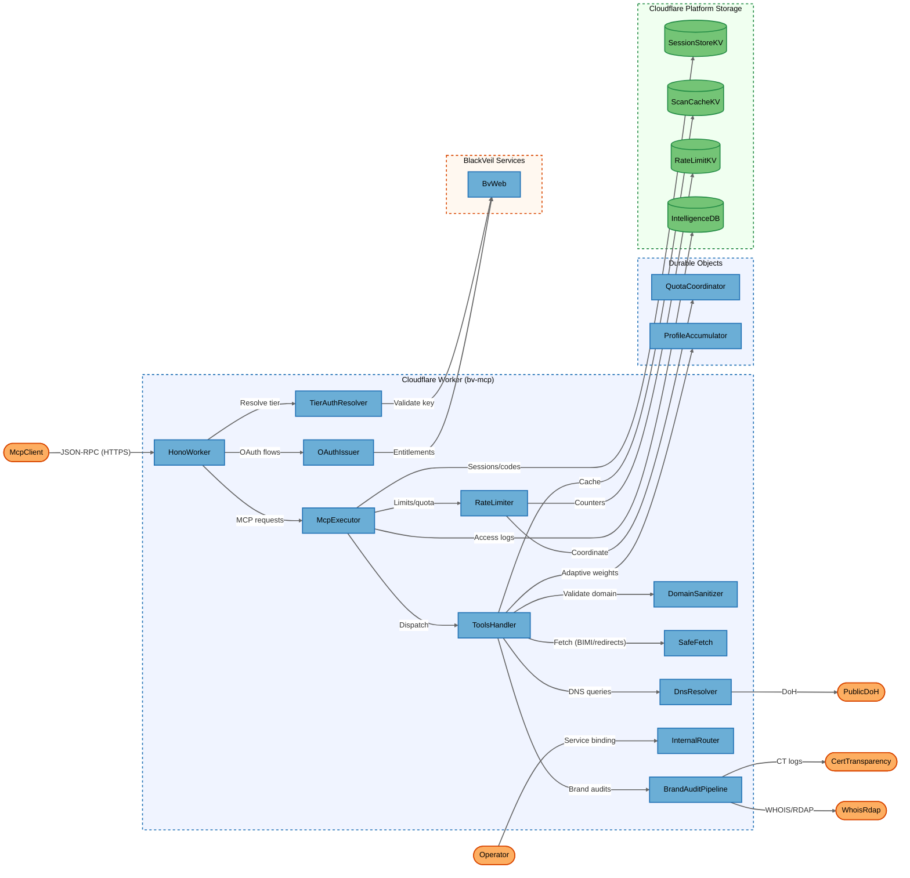
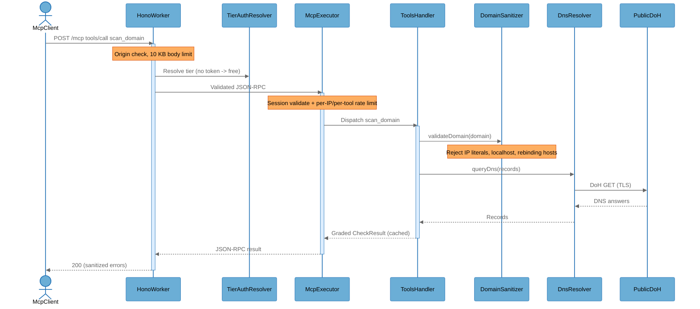
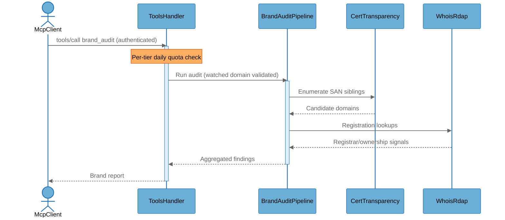

# Architecture Overview

## System Purpose

Blackveil DNS (`bv-mcp`) is a source-available DNS & email-security scanner delivered as a Cloudflare Worker. It exposes ~80 security tools through a Model Context Protocol (MCP) server over Streamable HTTP (JSON-RPC 2.0) at a public endpoint, plus an OAuth 2.1 issuer for paid tiers, a multi-tenant subsystem, and internal service-binding routes for sibling BlackVeil workers. Users are MCP clients (LLM IDEs, agents, `claude_*` clients) running unauthenticated free-tier scans or authenticated paid scans, and BlackVeil operators managing trial keys and OAuth grants.

## Key Components

| Component | Type | Description |
|-----------|------|-------------|
| McpClient | External Interactor | MCP client (LLM IDE/agent) calling `/mcp` over JSON-RPC; may be unauthenticated (free tier) or bearer/OAuth authenticated |
| Operator | External Interactor | BlackVeil operator using the static `BV_API_KEY` (owner tier) or driving `/internal/*` via the bv-web service binding |
| HonoWorker | Process | Edge HTTP router (`src/index.ts`); CORS/Origin checks, body-size limits, route gating, error wrapping |
| TierAuthResolver | Process | Resolves caller tier (`src/lib/tier-auth.ts`): constant-time `BV_API_KEY` compare, OAuth JWT verify, trial-key/bv-web lookup, `OWNER_ALLOW_IPS` gate |
| OAuthIssuer | Process | OAuth 2.1 issuer (`src/oauth/`): register, authorize, PKCE token exchange, HS256 JWT signing/validation, entitlements |
| McpExecutor | Process | MCP request pipeline (`src/mcp/execute.ts` + `dispatch.ts`): session validation, per-tier rate/quota application, method routing |
| ToolsHandler | Process | Tool registry + execution (`src/handlers/tools.ts`): lists/dispatches ~80 `check_*`/scan tools |
| DomainSanitizer | Process | Input validation/SSRF guard (`src/lib/sanitize.ts` + `config.ts` blocklists): `validateDomain`, `sanitizeDomain`, `validateOutboundUrl` |
| SafeFetch | Process | Egress SSRF guard (`src/lib/safe-fetch.ts`): HTTPS-only, manual redirects, RFC1918/reserved/rebinding rejection for attacker-influenced URLs |
| DnsResolver | Process | DoH egress (`src/lib/dns-transport.ts`, `dns-multi-resolver.ts`): Cloudflare DoH primary, `BV_DOH_ENDPOINT` secondary, Google fallback |
| RateLimiter | Process | Limits/quotas + abuse detection (`src/lib/rate-limiter.ts`, `fuzzing-detector.ts`): per-IP min/hr, per-tool daily, global ceiling, fuzzing scoring |
| InternalRouter | Process | Service-binding surface (`src/internal.ts`): `/internal/tools/*`, `/internal/oauth/grants`, `/internal/trial-keys/*`, guarded by `isPublicInternetRequest` |
| BrandAuditPipeline | Process | Brand-audit orchestration (`src/lib/brand-audit-pipeline.ts`) + cron/queue (`src/scheduled.ts`, queue consumer): tiered discovery, registrar/CT/WHOIS enrichment |
| QuotaCoordinator | Process | Durable Object (`src/lib/quota-coordinator.ts`): cross-isolate rate-limit/global-quota coordination with circuit-breaker fallback |
| ProfileAccumulator | Process | Durable Object (`src/lib/profile-accumulator.ts`): adaptive-scoring EMA persistence per profile+provider |
| SessionStoreKV | Data Store | KV `SESSION_STORE`: session records, OAuth authorization codes, JWT JTI revocation markers |
| ScanCacheKV | Data Store | KV `SCAN_CACHE`: cached scan/check results keyed by domain |
| RateLimitKV | Data Store | KV `RATE_LIMIT`: rate-limit counters, fuzzing counters, trial keys |
| IntelligenceDB | Data Store | D1 `INTELLIGENCE_DB`: MCP access logs with AES-GCM-encrypted IP evidence, ~90-day retention |
| BvWeb | External Service | Sibling worker (service binding): `validate-key` and OAuth entitlements resolution |
| PublicDoH | External Service | Public DoH resolvers (Cloudflare `cloudflare-dns.com`, Google fallback) for DNS queries |
| CertTransparency | External Service | `BV_CERTSTREAM` binding + crt.sh fallback for CT-log subdomain/SAN enumeration |
| WhoisRdap | External Service | `BV_WHOIS` binding + RDAP fallback for registration data |

## Component Diagram



## Top Scenarios

### Scenario 1: Unauthenticated free-tier domain scan

An MCP client calls `tools/call` for `scan_domain` over `/mcp`. The worker checks Origin, resolves tier (free if no token), validates the session, applies per-IP and per-tool rate limits, sanitizes the domain, runs DNS checks over DoH, caches the result, and returns a graded report.



### Scenario 2: OAuth 2.1 paid-tier token issuance

A paid MCP client completes the OAuth authorization-code + PKCE flow. The issuer resolves entitlements from bv-web, mints an HS256 JWT carrying a tier claim, and subsequent `/mcp` calls present it as a bearer token that `TierAuthResolver` verifies.

```mermaid
%%{init: {'theme': 'base', 'themeVariables': {
  'background': '#ffffff',
  'actorBkg': '#6baed6', 'actorBorder': '#2171b5', 'actorTextColor': '#000000',
  'signalColor': '#666666', 'signalTextColor': '#666666',
  'noteBkgColor': '#fdae61', 'noteBorderColor': '#d94701', 'noteTextColor': '#000000',
  'activationBkgColor': '#ddeeff', 'activationBorderColor': '#2171b5'
}}}%%
sequenceDiagram
    actor McpClient
    participant OAuthIssuer
    participant BvWeb
    participant SessionStoreKV
    participant TierAuthResolver

    McpClient->>OAuthIssuer: GET /oauth/authorize (PKCE challenge)
    activate OAuthIssuer
    OAuthIssuer->>BvWeb: Resolve plan -> tier entitlement
    BvWeb-->>OAuthIssuer: Tier (developer/enterprise)
    OAuthIssuer->>SessionStoreKV: Store auth code + challenge
    OAuthIssuer-->>McpClient: redirect with code
    deactivate OAuthIssuer
    McpClient->>OAuthIssuer: POST /oauth/token (code + verifier)
    activate OAuthIssuer
    Note over OAuthIssuer: PKCE S256 verify; sign HS256 JWT (tier claim, jti)
    OAuthIssuer-->>McpClient: access_token (JWT)
    deactivate OAuthIssuer
    McpClient->>TierAuthResolver: /mcp with Bearer JWT
    Note over TierAuthResolver: Verify alg=HS256, signature, exp/iss/aud, jti not revoked
```

### Scenario 3: Brand audit with tiered discovery

An authenticated client requests a brand audit. The pipeline enumerates candidate domains via CT logs and WHOIS/RDAP (and optional private intel bindings), enqueues deep-scan work, and aggregates results under per-tier quotas.



### Scenario 4: Internal service-binding tool call

A sibling worker (bv-web) calls `/internal/tools/call` via service binding. `isPublicInternetRequest` rejects any request carrying public proxy headers; credential-minting routes additionally require a `BV_WEB_INTERNAL_KEY` bearer.

### Scenario 5: Scheduled cron (fuzzing alerts + brand reaper)

Every 15 minutes the cron handler reads fuzzing counters, emits `fuzzing_suspected` alerts to `ALERT_WEBHOOK_URL`, runs analytics anomaly checks, and reaps stale brand-audit jobs.

## Technology Stack

| Layer | Technologies |
|-------|--------------|
| Languages | TypeScript (strict, ES2024) |
| Frameworks | Hono v4, Model Context Protocol (JSON-RPC 2.0 Streamable HTTP), Zod v4 |
| Data Stores | Cloudflare KV (RATE_LIMIT, SCAN_CACHE, SESSION_STORE), D1 (BRAND_AUDIT_DB, INTELLIGENCE_DB), R2 (BRAND_REPORTS), Durable Objects (QuotaCoordinator, ProfileAccumulator), Analytics Engine |
| Infrastructure | Cloudflare Workers (edge), Wrangler 4.x, service bindings (bv-web, certstream, whois, intel), Queues, cron triggers |
| Security | Constant-time XOR over SHA-256 (`tier-auth.ts`), HS256 OAuth JWT (`oauth/jwt.ts`), PKCE S256, SSRF allow/deny (`safe-fetch.ts`, `config.ts`), domain sanitization (`sanitize.ts`), rate limiting + global quota DO, fuzzing detector, AES-GCM access-log IP encryption, error allowlist (`json-rpc.ts`), `global_fetch_strictly_public` Worker flag |

## Deployment Model

`bv-mcp` is a single Cloudflare Worker deployed to the global edge and reachable over HTTPS (TLS terminated by Cloudflare) at a public hostname (`dns-mcp.blackveilsecurity.com`). The public surface is `POST/GET/DELETE /mcp`, the legacy SSE endpoints, `/oauth/*`, `/.well-known/oauth-*`, `/health`, and `/badge/:domain`. The `/internal/*` surface is reachable only via Cloudflare service bindings from sibling workers — public requests are rejected by `isPublicInternetRequest`. State lives in Cloudflare-managed KV, D1, R2, Queues, and two Durable Objects; none of these expose network listeners and are reachable only through in-account bindings. External egress is TLS-only to public DoH resolvers, CT logs, and RDAP/WHOIS, plus service-binding RPC to BlackVeil workers.

**Deployment Classification:** `NETWORK_SERVICE`

### Component Exposure Table

| Component | Listens On | Auth Required | Reachability | Min Prerequisite | Derived Tier |
|-----------|------------|---------------|--------------|------------------|-------------|
| McpClient | N/A — no listener | N/A | External | Host/OS Access | T3 |
| Operator | N/A — no listener | N/A | External | Host/OS Access | T3 |
| HonoWorker | 0.0.0.0:443 (CF edge) | No (free tier allowed) | External | None | T1 |
| TierAuthResolver | via HonoWorker (no own listener) | No (it is the auth) | External | None | T1 |
| OAuthIssuer | 0.0.0.0:443 `/oauth/*` | No (registration/authorize/token public) | External | None | T1 |
| McpExecutor | via HonoWorker (no own listener) | No (free tier allowed) | External | None | T1 |
| ToolsHandler | via HonoWorker (no own listener) | No (free tier allowed) | External | None | T1 |
| DomainSanitizer | N/A — invoked in request path | No | External | None | T1 |
| SafeFetch | N/A — egress library | No | External | None | T1 |
| DnsResolver | N/A — egress library | No | External | None | T1 |
| RateLimiter | N/A — invoked in request path | No | External | None | T1 |
| InternalRouter | service binding only | Conditional (lenient default; strict for credential-minting) | Internal Only | Internal Network | T2 |
| BrandAuditPipeline | via tools/call + queue/cron | Yes (paid tier quota) | External | Authenticated User | T2 |
| QuotaCoordinator | N/A — DO binding only | No (in-account binding) | No Listener | Host/OS Access | T3 |
| ProfileAccumulator | N/A — DO binding only | No (in-account binding) | No Listener | Host/OS Access | T3 |
| SessionStoreKV | N/A — KV binding only | No (in-account binding) | No Listener | Host/OS Access | T3 |
| ScanCacheKV | N/A — KV binding only | No (in-account binding) | No Listener | Host/OS Access | T3 |
| RateLimitKV | N/A — KV binding only | No (in-account binding) | No Listener | Host/OS Access | T3 |
| IntelligenceDB | N/A — D1 binding only | No (in-account binding) | No Listener | Host/OS Access | T3 |
| BvWeb | service binding (sibling worker) | Yes (`BV_WEB_INTERNAL_KEY`) | Internal Only | Internal Network | T2 |
| PublicDoH | external (TLS egress target) | N/A (TLS) | Internal Only | Internal Network | T2 |
| CertTransparency | service binding + crt.sh (TLS) | N/A | Internal Only | Internal Network | T2 |
| WhoisRdap | service binding + RDAP (TLS) | N/A | Internal Only | Internal Network | T2 |

## Security Infrastructure Inventory

| Component | Security Role | Configuration | Notes |
|-----------|---------------|---------------|-------|
| TierAuthResolver | Authentication & tiering | Constant-time XOR over SHA-256 for `BV_API_KEY`; OAuth JWT verify; trial-key/bv-web lookup; `OWNER_ALLOW_IPS` gate | `src/lib/tier-auth.ts`; owner downgraded to partner off-allowlist |
| OAuthIssuer | Token issuance/validation | HS256 with `OAUTH_SIGNING_SECRET` (≥32 bytes); alg pinned; PKCE S256; JTI revocation in KV | `src/oauth/jwt.ts`, `token.ts`; `JwtIssuableTierSchema` = owner/developer/enterprise |
| DomainSanitizer | Input validation / SSRF | Reject IP literals, localhost/.local/.onion, DNS-rebinding hosts; HTTPS-only outbound | `src/lib/sanitize.ts`, blocklists in `src/lib/config.ts` |
| SafeFetch | Egress SSRF guard | HTTPS-only, `redirect:'manual'`, RFC1918/reserved/link-local/IPv6-private/rebinding deny | `src/lib/safe-fetch.ts`; used for attacker-influenced URLs (BIMI `l=`, redirect targets) |
| RateLimiter | Abuse prevention | Per-IP 50/min + 300/hr (tools); per-tool daily quotas; 500K/day global ceiling; KV + DO + in-memory fallback | `src/lib/rate-limiter.ts`, `quota-coordinator.ts` |
| FuzzingDetector | Abuse detection | Sliding-window scoring on unknown_tool/unknown_method/zod_arg/auth_fail; webhook alerts | `src/lib/fuzzing-detector.ts`, thresholds in `config.ts` |
| SessionStore | Session management | 64-hex IDs (32 random bytes), 2 h idle TTL, KV + in-isolate map, creation 10/min per IP | `src/lib/session.ts`, `session-memory.ts` |
| ClientIp | Trust source | Only `cf-connecting-ip` trusted; `x-forwarded-for`/`x-real-ip` never trusted for security | `src/lib/ip-utils.ts` / client-ip |
| ErrorSanitizer | Information-disclosure control | Allowlist prefixes (`Missing required`, `Invalid`, `Domain `, `Resource not found`, `Rate limit exceeded`) else generic | `src/lib/json-rpc.ts` |
| AnalyticsClient | Privacy-preserving telemetry | FNV-1a IP hash (`i_` prefix), truncated key hash; no raw IPs in events | `src/lib/analytics.ts`, `log.ts` |
| AccessLog | Privacy-preserving audit | AES-GCM-encrypted IP evidence in D1, ~90-day retention, key versioned | `src/mcp/execute.ts`, `INTELLIGENCE_DB` |
| InternalGuard | Internal isolation | `isPublicInternetRequest` rejects public proxy headers; bearer gate for credential-minting | `src/internal.ts` |
| OriginCheck | CSRF/abuse control | Allowlisted Origins + desktop IDE schemes; MCP-compliant rejection | `src/index.ts` `checkOrigin` |

## Repository Structure

| Directory | Purpose |
|-----------|---------|
| `src/mcp/` | MCP protocol: execute, dispatch, request parsing, route gates |
| `src/schemas/` | Zod schemas: tool-args + TOOL_SCHEMA_MAP, tool-definitions, json-rpc, auth, session, internal |
| `src/handlers/` | tools/list+call, resources, prompts, tool-args/formatters |
| `src/tools/` | `check-*`, scan-domain, discover-subdomains, brand-audit entrypoints |
| `src/oauth/` | OAuth 2.1 issuer: discovery, register, authorize, token, JWT, KV storage, entitlements |
| `src/tenants/` | Multi-tenant subsystem (resolver, routes, per-tenant rate limit, queue consumer) |
| `src/lib/` | Auth, SSRF, DNS, cache, session, rate-limiter, scoring, fuzzing, analytics, brand-audit, Durable Objects |
| `src/queue/` | Async brand-audit / PDF queue consumers |
| `packages/dns-checks/` | Runtime-agnostic core: scoring + checks + schemas (`@blackveil/dns-checks`) |
