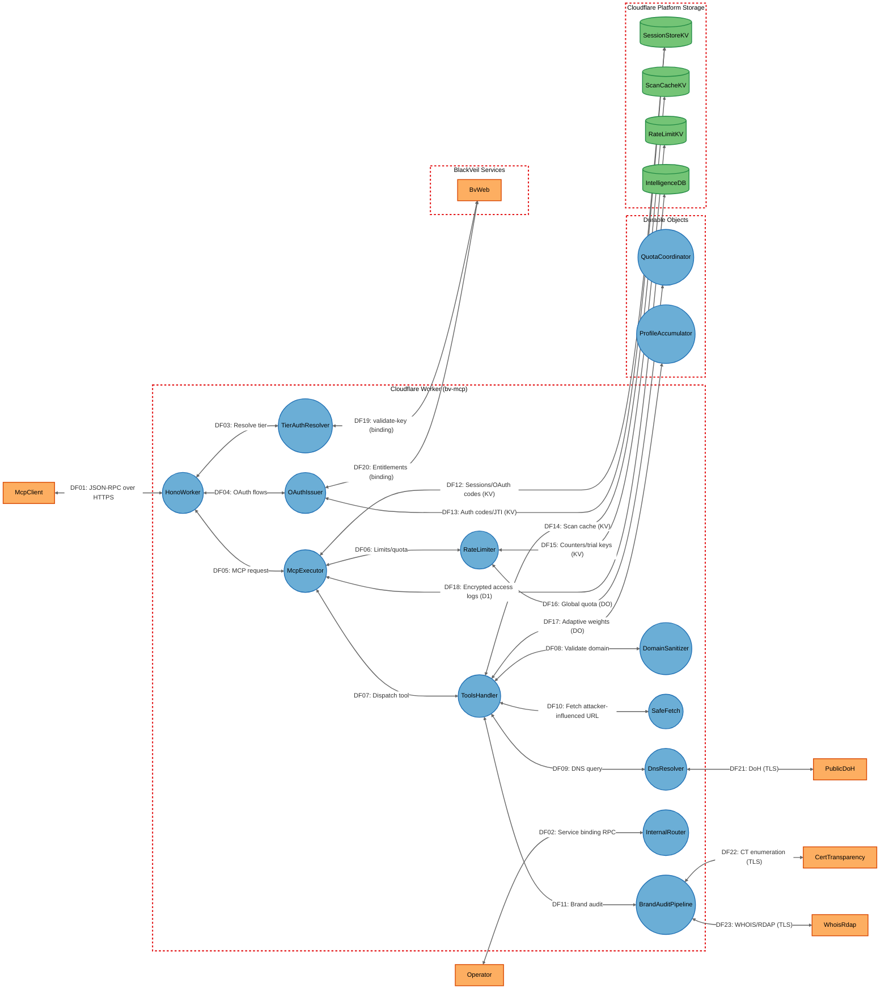
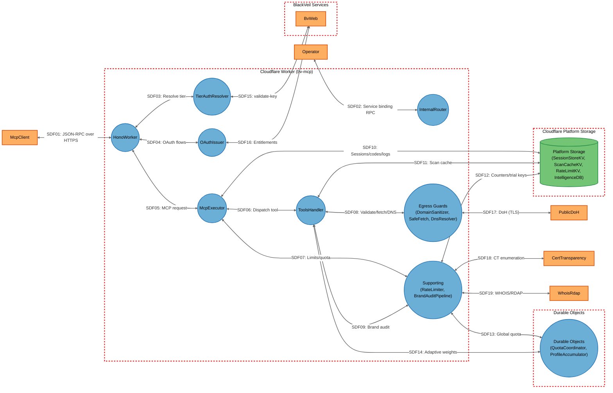

# Threat Model

## Data Flow Diagram

## Element Table

| Element | Type | TMT Category | Description | Trust Boundary |
|---------|------|--------------|-------------|----------------|
| McpClient | External Interactor | SE.EI.TMCore.WebApp | MCP client (LLM IDE/agent) calling `/mcp` | Internet |
| Operator | External Interactor | SE.EI.TMCore.User | BlackVeil operator (owner key / bv-web binding) | Internet |
| HonoWorker | Process | SE.P.TMCore.WebServer | Edge HTTP router; CORS/Origin, body-limit, routing | CloudflareWorker |
| TierAuthResolver | Process | SE.P.TMCore.WebSvc | Caller tier resolution & authentication | CloudflareWorker |
| OAuthIssuer | Process | SE.P.TMCore.WebSvc | OAuth 2.1 issuer (JWT, PKCE, entitlements) | CloudflareWorker |
| McpExecutor | Process | SE.P.TMCore.WebSvc | MCP pipeline: session, rate/quota, dispatch | CloudflareWorker |
| ToolsHandler | Process | SE.P.TMCore.WebSvc | Tool registry + execution (~80 tools) | CloudflareWorker |
| DomainSanitizer | Process | SE.P.TMCore.WebSvc | Domain input validation / SSRF input guard | CloudflareWorker |
| SafeFetch | Process | SE.P.TMCore.WebSvc | Egress SSRF guard for attacker-influenced URLs | CloudflareWorker |
| DnsResolver | Process | SE.P.TMCore.WebSvc | DoH egress (multi-resolver) | CloudflareWorker |
| RateLimiter | Process | SE.P.TMCore.WebSvc | Rate limits, quotas, fuzzing detection | CloudflareWorker |
| InternalRouter | Process | SE.P.TMCore.WebSvc | Service-binding `/internal/*` surface | CloudflareWorker |
| BrandAuditPipeline | Process | SE.P.TMCore.WebSvc | Brand-audit orchestration + cron/queue | CloudflareWorker |
| QuotaCoordinator | Process | SE.P.TMCore.WebSvc | Durable Object: cross-isolate quota coordination | DurableObjects |
| ProfileAccumulator | Process | SE.P.TMCore.WebSvc | Durable Object: adaptive-scoring persistence | DurableObjects |
| SessionStoreKV | Data Store | SE.DS.TMCore.NoSQL | KV: sessions, OAuth codes, JTI revocation | PlatformStorage |
| ScanCacheKV | Data Store | SE.DS.TMCore.Cache | KV: cached scan/check results | PlatformStorage |
| RateLimitKV | Data Store | SE.DS.TMCore.NoSQL | KV: rate/fuzzing counters, trial keys | PlatformStorage |
| IntelligenceDB | Data Store | SE.DS.TMCore.SQL | D1: access logs with AES-GCM-encrypted IP evidence | PlatformStorage |
| BvWeb | External Interactor | SE.EI.TMCore.WebSvc | Sibling worker: validate-key + OAuth entitlements | BlackVeilServices |
| PublicDoH | External Interactor | SE.EI.TMCore.WebSvc | Public DoH resolvers (Cloudflare/Google) | Internet |
| CertTransparency | External Interactor | SE.EI.TMCore.WebSvc | CT-log enumeration (certstream/crt.sh) | Internet |
| WhoisRdap | External Interactor | SE.EI.TMCore.WebSvc | WHOIS/RDAP registration lookups | Internet |

## Data Flow Table

| ID | Source | Target | Protocol | Description |
|----|--------|--------|----------|-------------|
| DF01 | McpClient | HonoWorker | HTTPS (JSON-RPC) | MCP requests over Streamable HTTP |
| DF02 | Operator | InternalRouter | Service binding RPC | Internal tool/grant/trial-key calls |
| DF03 | HonoWorker | TierAuthResolver | In-process | Resolve caller tier from token/key |
| DF04 | HonoWorker | OAuthIssuer | In-process | OAuth register/authorize/token flows |
| DF05 | HonoWorker | McpExecutor | In-process | Validated JSON-RPC dispatch |
| DF06 | McpExecutor | RateLimiter | In-process | Apply per-IP/per-tool/global limits |
| DF07 | McpExecutor | ToolsHandler | In-process | Dispatch tools/call |
| DF08 | ToolsHandler | DomainSanitizer | In-process | Validate/sanitize domain input |
| DF09 | ToolsHandler | DnsResolver | In-process | Issue DNS record queries |
| DF10 | ToolsHandler | SafeFetch | In-process | Fetch attacker-influenced URLs (BIMI/redirects) |
| DF11 | ToolsHandler | BrandAuditPipeline | In-process | Run brand audit |
| DF12 | McpExecutor | SessionStoreKV | KV API (TLS) | Read/write sessions and OAuth codes |
| DF13 | OAuthIssuer | SessionStoreKV | KV API (TLS) | Store auth codes / JTI revocation |
| DF14 | ToolsHandler | ScanCacheKV | KV API (TLS) | Read/write cached results |
| DF15 | RateLimiter | RateLimitKV | KV API (TLS) | Read/write counters and trial keys |
| DF16 | RateLimiter | QuotaCoordinator | DO RPC | Global daily quota coordination |
| DF17 | ToolsHandler | ProfileAccumulator | DO RPC | Adaptive scoring weights |
| DF18 | McpExecutor | IntelligenceDB | D1 (TLS) | Write encrypted access-log evidence |
| DF19 | TierAuthResolver | BvWeb | Service binding RPC | validate-key tier resolution |
| DF20 | OAuthIssuer | BvWeb | Service binding RPC | Plan-to-tier entitlement lookup |
| DF21 | DnsResolver | PublicDoH | HTTPS (DoH) | DNS-over-HTTPS queries |
| DF22 | BrandAuditPipeline | CertTransparency | HTTPS | CT-log SAN/subdomain enumeration |
| DF23 | BrandAuditPipeline | WhoisRdap | HTTPS | Registration/ownership lookups |

## Trust Boundary Table

| Boundary | Description | Contains |
|----------|-------------|----------|
| Internet | Public internet — untrusted external actors and third-party services reachable over TLS | McpClient, Operator, PublicDoH, CertTransparency, WhoisRdap |
| CloudflareWorker | The bv-mcp Worker isolate at the Cloudflare edge; all request-path logic runs here | HonoWorker, TierAuthResolver, OAuthIssuer, McpExecutor, ToolsHandler, DomainSanitizer, SafeFetch, DnsResolver, RateLimiter, InternalRouter, BrandAuditPipeline |
| DurableObjects | Cloudflare Durable Objects — stateful single-instance coordinators reachable only via in-account bindings | QuotaCoordinator, ProfileAccumulator |
| PlatformStorage | Cloudflare-managed KV/D1 stores reachable only via in-account bindings (no network listeners) | SessionStoreKV, ScanCacheKV, RateLimitKV, IntelligenceDB |
| BlackVeilServices | Sibling BlackVeil workers reachable via authenticated service bindings | BvWeb |

## Summary View

## Summary to Detailed Mapping

| Summary Element | Contains | Summary Flows | Maps to Detailed Flows |
|-----------------|----------|---------------|------------------------|
| EgressGuards | DomainSanitizer, SafeFetch, DnsResolver | SDF08, SDF17 | DF08, DF09, DF10, DF21 |
| SupportingServices | RateLimiter, BrandAuditPipeline | SDF07, SDF09, SDF12, SDF13, SDF18, SDF19 | DF06, DF11, DF15, DF16, DF22, DF23 |
| DurableObjectsGroup | QuotaCoordinator, ProfileAccumulator | SDF13, SDF14 | DF16, DF17 |
| PlatformStorageGroup | SessionStoreKV, ScanCacheKV, RateLimitKV, IntelligenceDB | SDF10, SDF11, SDF12 | DF12, DF13, DF14, DF15, DF18 |
| HonoWorker | HonoWorker | SDF01, SDF03, SDF04, SDF05 | DF01, DF03, DF04, DF05 |
| McpExecutor | McpExecutor | SDF05, SDF06, SDF07, SDF10 | DF05, DF06, DF07, DF12, DF18 |
| ToolsHandler | ToolsHandler | SDF06, SDF08, SDF09, SDF11, SDF14 | DF07, DF08, DF09, DF10, DF11, DF14, DF17 |
| TierAuthResolver | TierAuthResolver | SDF03, SDF15 | DF03, DF19 |
| OAuthIssuer | OAuthIssuer | SDF04, SDF16 | DF04, DF13, DF20 |
| InternalRouter | InternalRouter | SDF02 | DF02 |
