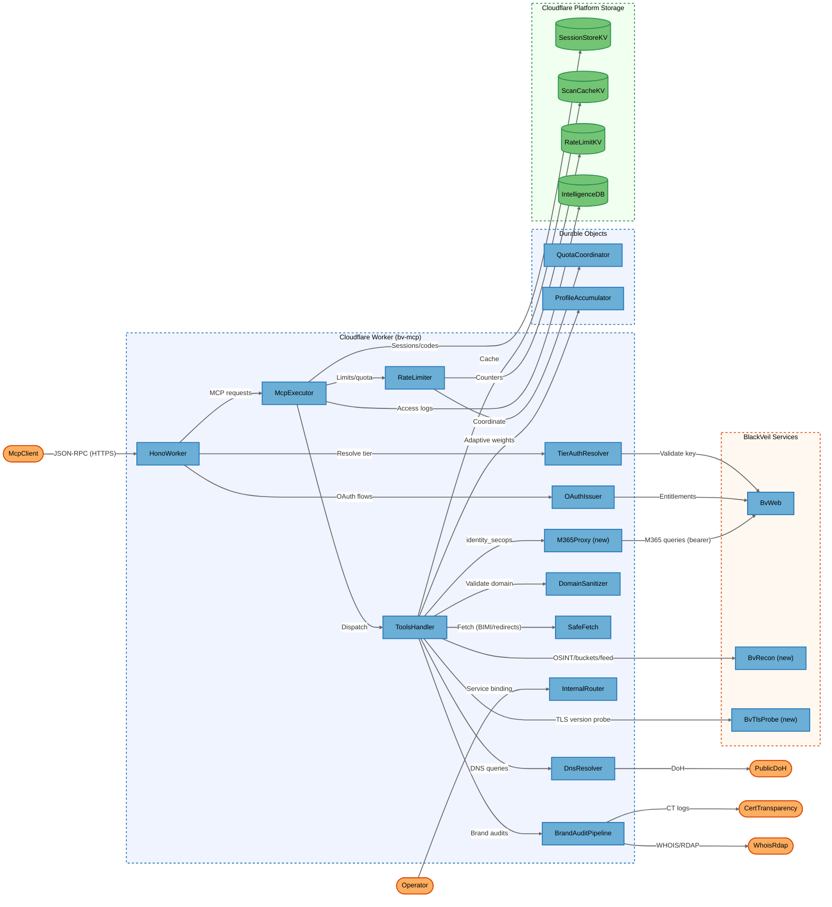
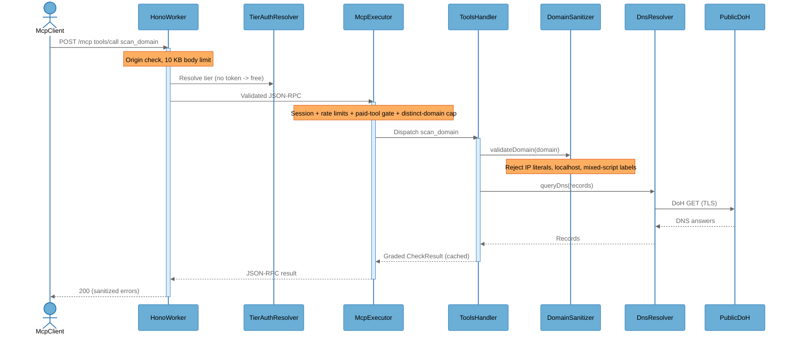
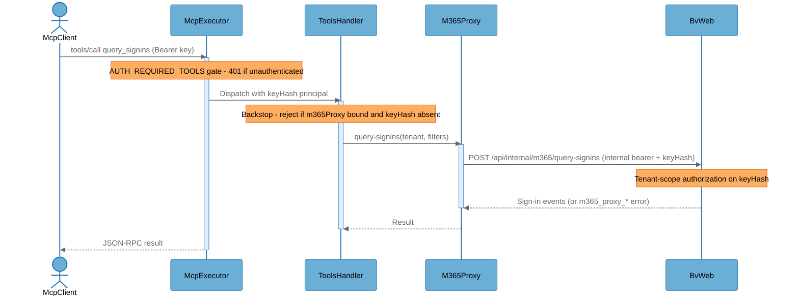

# Architecture Overview

> **Incremental analysis** — baseline `threat-model-20260524-114907` (commit `7e23243`), interim status overlay `threat-model-20260524-184006-incremental` (commit `f75ca7d`), target commit `7a1c6b3` (2026-06-11, v3.18.0). 230 commits / ~159 PRs in the window. Component IDs are inherited from the baseline; three components are new.

## System Purpose

Blackveil DNS (`bv-mcp`) is a source-available DNS & email-security scanner delivered as a Cloudflare Worker. It exposes 80 security tools through a Model Context Protocol (MCP) server over Streamable HTTP (JSON-RPC 2.0) at a public endpoint, plus an OAuth 2.1 issuer for paid tiers, a multi-tenant subsystem, and internal service-binding routes for sibling BlackVeil workers. Users are MCP clients (LLM IDEs, agents, `claude_*` clients) running unauthenticated free-tier scans or authenticated paid scans, BlackVeil operators managing trial keys and OAuth grants, and — new in this window — the bv-web agent-chat feature calling a restricted read-only tool set over the internal binding.

## Key Components

| Component | Type | Description |
|-----------|------|-------------|
| McpClient | External Interactor | MCP client (LLM IDE/agent) calling `/mcp` over JSON-RPC; may be unauthenticated (free tier) or bearer/OAuth authenticated |
| Operator | External Interactor | BlackVeil operator using the static `BV_API_KEY`/`BV_INTERNAL_DEV_KEY` (owner tier) or driving `/internal/*` via the bv-web service binding |
| HonoWorker | Process | [MODIFIED — security-relevant changes detected] Edge HTTP router (`src/index.ts`); CORS/Origin checks, body-size limits, route gating, error wrapping; threads BV_RECON/BV_TLS_PROBE/M365 bindings into tool runtime options and rejects unsupported `MCP-Protocol-Version` values with HTTP 400. Browser preflight permits `MCP-Protocol-Version` and `Last-Event-ID` |
| TierAuthResolver | Process | [MODIFIED — security-relevant changes detected] Resolves caller tier (`src/lib/tier-auth.ts`): constant-time static-key compare (now two independent dev-key slots), OAuth JWT verify with stable `keyHash` derivation, trial-key/bv-web lookup with expiry re-check, last-known-good (LKG) tier cache for bv-web 5xx outages, `OWNER_ALLOW_IPS` gate applied on every owner-tier path |
| OAuthIssuer | Process | [MODIFIED — security-relevant changes detected] OAuth 2.1 issuer (`src/oauth/`): register, authorize, PKCE token exchange, HS256 JWT signing/validation, entitlements; JWT lifetime now clamped to the caller's entitlement window and per-subject token-version (`ver`) revocation is live |
| McpExecutor | Process | [MODIFIED — security-relevant changes detected] MCP request pipeline (`src/mcp/execute.ts` + `dispatch.ts`): session validation, per-tier rate/quota application, method routing; notifications require the same valid assigned session as other post-initialize HTTP requests; also enforces `GATED_PAID_ONLY_TOOLS` (HTTP 403/-32003), `AUTH_REQUIRED_TOOLS` (HTTP 401/-32001), the per-IP distinct-domain daily cap, and threads `keyHash` to handlers (3.17.2 P0 fix) |
| ToolsHandler | Process | [MODIFIED — security-relevant changes detected] Tool registry + execution (`src/handlers/tools.ts`): lists/dispatches 80 `check_*`/scan tools; new registry entries for recon/M365/TLS-probe-backed tools, KV request-dedup for mutating `*_start`/`register_*` tools keyed on `keyHash` only, versioned cache keys embedding the dns-checks version |
| M365Proxy | Process | [NEW] Identity-secops tool family (`src/tools/m365/proxy.ts` + query-signins/query-ual/get-ca-policies/assess-coverage): authenticated-only proxy that forwards M365 sign-in/UAL/Conditional-Access queries to bv-web's internal `/api/internal/m365/*` endpoints carrying `BV_WEB_INTERNAL_KEY` and the caller's `keyHash` principal |
| DomainSanitizer | Process | [MODIFIED — security-relevant changes detected] Input validation/SSRF guard (`src/lib/sanitize.ts` + `config.ts` blocklists): `validateDomain`, `sanitizeDomain` (mixed-script/homoglyph rejection), `validateOutboundUrl`; validation helpers extended in the window without posture change |
| SafeFetch | Process | Egress SSRF guard (`src/lib/safe-fetch.ts`): HTTPS-only, manual redirects, RFC1918/reserved/rebinding rejection for attacker-influenced URLs |
| DnsResolver | Process | DoH egress (`src/lib/dns-transport.ts`, `dns-multi-resolver.ts`): Cloudflare DoH primary, `BV_DOH_ENDPOINT` secondary, Google fallback |
| RateLimiter | Process | [MODIFIED — security-relevant changes detected] Limits/quotas + abuse detection (`src/lib/rate-limiter.ts`, `fuzzing-detector.ts`): per-IP min/hr, per-tool daily, global ceiling, fuzzing scoring; new `checkDistinctDomainDailyLimit()` capping unauthenticated callers at 12 distinct domains/day per IP |
| InternalRouter | Process | [MODIFIED — security-relevant changes detected] Service-binding surface (`src/internal.ts`): `/internal/tools/*`, `/internal/oauth/grants`, `/internal/trial-keys/*`, `/internal/tenants/*`, guarded by `isPublicInternetRequest`; bearer gate (`internalLenientAuthGate`) is now secure-by-default, and the `x-bv-caller: agent-chat` principal is restricted to a 13-tool read-only allowlist |
| BrandAuditPipeline | Process | Brand-audit orchestration (`src/lib/brand-audit-pipeline.ts`) + cron/queue (`src/scheduled.ts`, queue consumer): tiered discovery, registrar/CT/WHOIS enrichment; ownership attestation remains caller-supplied |
| QuotaCoordinator | Process | Durable Object (`src/lib/quota-coordinator.ts`): cross-isolate rate-limit/global-quota coordination with circuit-breaker fallback |
| ProfileAccumulator | Process | Durable Object (`src/lib/profile-accumulator.ts`): adaptive-scoring EMA persistence per profile+provider |
| SessionStoreKV | Data Store | KV `SESSION_STORE`: session records, OAuth authorization codes, JWT JTI revocation markers, per-subject token-version counters |
| ScanCacheKV | Data Store | [MODIFIED — security-relevant changes detected] KV `SCAN_CACHE`: cached scan/check results; cache keys now embed both the server version and the dns-checks version (`cache:v<srv>-dc<dns>:<domain>…`) so library bumps invalidate stale scores |
| RateLimitKV | Data Store | [MODIFIED — security-relevant changes detected] KV `RATE_LIMIT`: rate-limit counters, fuzzing counters, trial keys, distinct-domain markers, request-dedup records; AES-256-GCM KV envelope helper (`kv-envelope.ts`) exists but trial-key records are not yet wrapped |
| IntelligenceDB | Data Store | [MODIFIED — security-relevant changes detected] D1 `INTELLIGENCE_DB`: MCP access logs with AES-GCM-encrypted IP evidence; a scheduled retention job now deletes rows older than 90 days |
| BvWeb | External Service | [MODIFIED — security-relevant changes detected] Sibling worker (service binding): `validate-key`, OAuth entitlements resolution, and now the internal M365 proxy endpoints; bv-mcp delegates M365 tenant-scope authorization to bv-web on the forwarded `keyHash` |
| BvRecon | External Service | [NEW] Operator-deploy-only bv-recon worker (`src/lib/recon-binding.ts`, `BV_RECON` + `BV_RECON_KEY` bearer): powers OSINT investigations, bucket scans, and the realtime threat feed via a start→poll pattern; fail-soft `unprovisioned` when absent; upstream payloads scrubbed by `sanitize-upstream.ts` before entering finding metadata |
| BvTlsProbe | External Service | [NEW] Operator-deploy-only bv-tls-probe worker (`src/lib/tls-probe-binding.ts`, `BV_TLS_PROBE` + `BV_TLS_PROBE_KEY` bearer): version-aware TLS handshakes enriching `check_ssl` legacy-TLS detection; fail-soft no-op when absent |
| PublicDoH | External Service | Public DoH resolvers (Cloudflare `cloudflare-dns.com`, Google fallback) for DNS queries |
| CertTransparency | External Service | `BV_CERTSTREAM` binding + crt.sh fallback for CT-log subdomain/SAN enumeration |
| WhoisRdap | External Service | `BV_WHOIS` binding + RDAP fallback for registration data; lookalike enrichment also queries a hardcoded allowlist of registry RDAP endpoints |

## Component Diagram



## Top Scenarios

### Scenario 1: Unauthenticated free-tier domain scan

An MCP client calls `tools/call` for `scan_domain` over `/mcp`. The worker checks Origin, resolves tier (free if no token), validates the session, applies per-IP and per-tool rate limits plus the new 12-distinct-domains/day cap, sanitizes the domain, runs DNS checks over DoH, caches the result under a version-stamped key, and returns a graded report. Paid-only tools return HTTP 403 (`-32003`) at this tier.



### Scenario 2: OAuth 2.1 paid-tier token issuance

A paid MCP client completes the OAuth authorization-code + PKCE flow. The issuer resolves entitlements from bv-web, mints an HS256 JWT carrying a tier claim and a per-subject token-version (`ver`), clamps the JWT lifetime to the remaining entitlement window, and subsequent `/mcp` calls present it as a bearer token that `TierAuthResolver` verifies (deriving a stable `keyHash` for quota/concurrency keying).

```mermaid
%%{init: {'theme': 'base', 'themeVariables': {
  'background': '#ffffff',
  'actorBkg': '#6baed6', 'actorBorder': '#2171b5', 'actorTextColor': '#000000',
  'signalColor': '#666666', 'signalTextColor': '#666666',
  'noteBkgColor': '#fdae61', 'noteBorderColor': '#d94701', 'noteTextColor': '#000000',
  'activationBkgColor': '#ddeeff', 'activationBorderColor': '#2171b5'
}}}%%
sequenceDiagram
    actor McpClient
    participant OAuthIssuer
    participant BvWeb
    participant SessionStoreKV
    participant TierAuthResolver

    McpClient->>OAuthIssuer: GET /oauth/authorize (PKCE challenge)
    activate OAuthIssuer
    OAuthIssuer->>BvWeb: Resolve plan -> tier entitlement
    BvWeb-->>OAuthIssuer: Tier (developer/enterprise) + entitlement window
    OAuthIssuer->>SessionStoreKV: Store auth code + challenge
    OAuthIssuer-->>McpClient: redirect with code
    deactivate OAuthIssuer
    McpClient->>OAuthIssuer: POST /oauth/token (code + verifier)
    activate OAuthIssuer
    Note over OAuthIssuer: PKCE S256 verify; HS256 JWT with tier, jti, ver; TTL clamped to entitlement
    OAuthIssuer-->>McpClient: access_token (JWT)
    deactivate OAuthIssuer
    McpClient->>TierAuthResolver: /mcp with Bearer JWT
    Note over TierAuthResolver: Verify alg, signature, exp/iss/aud, jti, ver >= stored version
```

### Scenario 3: Authenticated identity-secops M365 query (new)

An authenticated customer calls `query_signins` for their M365 tenant. The executor rejects unauthenticated callers (HTTP 401), the handler re-checks that a `keyHash` principal is present, and `M365Proxy` forwards the query to bv-web's internal M365 endpoints with the internal bearer plus the caller's `keyHash`; bv-web enforces that the principal is entitled to the requested tenant before querying Microsoft Graph.



### Scenario 4: Paid-tier OSINT investigation via bv-recon (new)

A developer-tier client calls `osint_investigate_domain_start`. The paid-only gate admits the caller, request-dedup (keyed on `keyHash` + tool + canonical args) absorbs network retries, and the recon binding starts an investigation on bv-recon returning an opaque investigation ID. The client polls `osint_investigation_status`/`_report`; upstream payloads are scrubbed by `sanitize-upstream` before entering finding metadata.

### Scenario 5: Internal service-binding tool call (agent-chat restricted)

A sibling worker (bv-web) calls `/internal/tools/call` via service binding. `isPublicInternetRequest` rejects any request carrying public proxy headers; the secure-by-default bearer gate requires `Authorization: Bearer ${BV_WEB_INTERNAL_KEY}` (503 if unset, 401 on mismatch) unless explicitly disabled. Requests carrying `x-bv-caller: agent-chat` are additionally restricted to a 13-tool read-only allowlist (403 `agent_tool_not_allowed` otherwise).

### Scenario 6: Scheduled cron (fuzzing alerts, brand reaper, log retention)

Every 15 minutes the cron handler reads fuzzing counters, emits `fuzzing_suspected` alerts to `ALERT_WEBHOOK_URL`, runs analytics anomaly checks, reaps stale brand-audit jobs, and deletes `mcp_access_log` rows older than 90 days via a parameterized D1 query.

## Technology Stack

| Layer | Technologies |
|-------|--------------|
| Languages | TypeScript (strict, ES2024) |
| Frameworks | Hono v4, Model Context Protocol (JSON-RPC 2.0 Streamable HTTP, protocol versions 2025-03-26 / 2025-06-18), Zod v4 |
| Data Stores | Cloudflare KV (RATE_LIMIT, SCAN_CACHE, SESSION_STORE), D1 (BRAND_AUDIT_DB, INTELLIGENCE_DB), R2 (BRAND_REPORTS), Durable Objects (QuotaCoordinator, ProfileAccumulator), Analytics Engine |
| Infrastructure | Cloudflare Workers (edge), Wrangler 4.x, service bindings (bv-web, certstream, whois, intel, bv-recon, bv-tls-probe), Queues, cron triggers |
| Security | Constant-time XOR over SHA-256 (`tier-auth.ts`), HS256 OAuth JWT with `ver` revocation + entitlement TTL clamp (`oauth/jwt.ts`, `token.ts`), PKCE S256, SSRF allow/deny (`safe-fetch.ts`, `config.ts`), domain sanitization incl. mixed-script rejection (`sanitize.ts`), rate limiting + distinct-domain cap + global quota DO, paid-tool gating (`GATED_PAID_ONLY_TOOLS`), auth-required tooling (`AUTH_REQUIRED_TOOLS`), agent-chat tool allowlist (`AGENT_ALLOWED_TOOLS`), request-dedup (`request-dedup.ts`), upstream-payload sanitization (`sanitize-upstream.ts`), AES-256-GCM KV envelope helper (`kv-envelope.ts`), fuzzing detector, AES-GCM access-log IP encryption, error allowlist (`json-rpc.ts`), `global_fetch_strictly_public` Worker flag |

## Deployment Model

`bv-mcp` is a single Cloudflare Worker deployed to the global edge and reachable over HTTPS (TLS terminated by Cloudflare) at a public hostname (`dns-mcp.blackveilsecurity.com`). The public surface is `POST/GET/DELETE /mcp`, the legacy SSE endpoints, `/oauth/*`, `/.well-known/oauth-*`, `/health`, and `/badge/:domain`. The `/internal/*` surface is reachable only via Cloudflare service bindings from sibling workers — public requests are rejected by `isPublicInternetRequest`, and the bearer gate is active by default. State lives in Cloudflare-managed KV, D1, R2, Queues, and two Durable Objects; none of these expose network listeners and are reachable only through in-account bindings. External egress is TLS-only to public DoH resolvers, CT logs, and RDAP/WHOIS, plus service-binding RPC to BlackVeil workers (bv-web, bv-recon, bv-tls-probe — the latter two operator-deploy-only and fail-soft when absent).

**Deployment Classification:** `NETWORK_SERVICE`

### Component Exposure Table

| Component | Listens On | Auth Required | Reachability | Min Prerequisite | Derived Tier |
|-----------|------------|---------------|--------------|------------------|-------------|
| McpClient | N/A — no listener | N/A | External | Host/OS Access | T3 |
| Operator | N/A — no listener | N/A | External | Host/OS Access | T3 |
| HonoWorker | 0.0.0.0:443 (CF edge) | No (free tier allowed) | External | None | T1 |
| TierAuthResolver | via HonoWorker (no own listener) | No (it is the auth) | External | None | T1 |
| OAuthIssuer | 0.0.0.0:443 `/oauth/*` | No (registration/authorize/token public) | External | None | T1 |
| McpExecutor | via HonoWorker (no own listener) | No (free tier allowed) | External | None | T1 |
| ToolsHandler | via HonoWorker (no own listener) | No (free tier allowed) | External | None | T1 |
| M365Proxy | via HonoWorker `tools/call` (no own listener) | Yes (`AUTH_REQUIRED_TOOLS` — valid API key/JWT) | External | Authenticated User | T2 |
| DomainSanitizer | N/A — invoked in request path | No | External | None | T1 |
| SafeFetch | N/A — egress library | No | External | None | T1 |
| DnsResolver | N/A — egress library | No | External | None | T1 |
| RateLimiter | N/A — invoked in request path | No | External | None | T1 |
| InternalRouter | service binding only | Yes (secure-by-default bearer; strict for credential-minting) | Internal Only | Internal Network | T2 |
| BrandAuditPipeline | via tools/call + queue/cron | Yes (paid tier quota) | External | Authenticated User | T2 |
| QuotaCoordinator | N/A — DO binding only | No (in-account binding) | No Listener | Host/OS Access | T3 |
| ProfileAccumulator | N/A — DO binding only | No (in-account binding) | No Listener | Host/OS Access | T3 |
| SessionStoreKV | N/A — KV binding only | No (in-account binding) | No Listener | Host/OS Access | T3 |
| ScanCacheKV | N/A — KV binding only | No (in-account binding) | No Listener | Host/OS Access | T3 |
| RateLimitKV | N/A — KV binding only | No (in-account binding) | No Listener | Host/OS Access | T3 |
| IntelligenceDB | N/A — D1 binding only | No (in-account binding) | No Listener | Host/OS Access | T3 |
| BvWeb | service binding (sibling worker) | Yes (`BV_WEB_INTERNAL_KEY`) | Internal Only | Internal Network | T2 |
| BvRecon | service binding (sibling worker) | Yes (`BV_RECON_KEY` bearer) | Internal Only | Authenticated User | T2 |
| BvTlsProbe | service binding (sibling worker) | Yes (`BV_TLS_PROBE_KEY` bearer) | Internal Only | Internal Network | T2 |
| PublicDoH | external (TLS egress target) | N/A (TLS) | Internal Only | Internal Network | T2 |
| CertTransparency | service binding + crt.sh (TLS) | N/A | Internal Only | Internal Network | T2 |
| WhoisRdap | service binding + RDAP (TLS) | N/A | Internal Only | Internal Network | T2 |

## Security Infrastructure Inventory

| Component | Security Role | Configuration | Notes |
|-----------|---------------|---------------|-------|
| TierAuthResolver | Authentication & tiering | Constant-time XOR over SHA-256 for both static dev keys; OAuth JWT verify with `ver` check + `keyHash` derivation; trial-key expiry re-check on cache hit; LKG tier cache (24 h, 5xx-only); `OWNER_ALLOW_IPS` gate on every owner path | `src/lib/tier-auth.ts`; owner downgraded to partner off-allowlist |
| OAuthIssuer | Token issuance/validation | HS256 with `OAUTH_SIGNING_SECRET` (≥32 bytes); alg pinned; PKCE S256; JTI revocation in KV; per-subject token-version (`bumpTokenVersion`); JWT TTL clamped to entitlement window | `src/oauth/jwt.ts`, `token.ts`, `storage.ts` |
| DomainSanitizer | Input validation / SSRF | Reject IP literals, localhost/.local/.onion, DNS-rebinding hosts, mixed-script (homoglyph) labels; HTTPS-only outbound | `src/lib/sanitize.ts`, blocklists in `src/lib/config.ts` |
| SafeFetch | Egress SSRF guard | HTTPS-only, `redirect:'manual'`, RFC1918/reserved/link-local/IPv6-private/rebinding deny | `src/lib/safe-fetch.ts`; verified used by all new attacker-influenced fetch paths (lookalike web probe, brand CSC enrichment) |
| RateLimiter | Abuse prevention | Per-IP 50/min + 300/hr (tools); per-tool daily quotas; 500K/day global ceiling; 12 distinct domains/day per unauthenticated IP; KV + DO + in-memory fallback | `src/lib/rate-limiter.ts`, `quota-coordinator.ts` |
| PaidToolGate | Commercial/abuse gating | `GATED_PAID_ONLY_TOOLS` → HTTP 403 `-32003` for free/agent/unauthenticated; pinned to 0 in free/agent quota maps | `src/lib/config.ts:340-378`, `src/mcp/execute.ts` |
| AuthRequiredGate | Sensitive-tool gating | `AUTH_REQUIRED_TOOLS` (identity_secops) → HTTP 401 `-32001` pre-dispatch; handler backstop rejects when `keyHash` absent | `src/lib/config.ts:444-454`, `src/mcp/execute.ts:601-603`, `src/handlers/tools.ts:909-912` |
| AgentChatAllowlist | Internal least-privilege | `x-bv-caller: agent-chat` → 13 read-only tools on `/internal/tools/*`; 403 otherwise; exact-set audit test | `src/lib/config.ts:390-410`, `src/internal.ts:217-223,419-422` |
| RequestDedup | Replay/duplicate control | SHA-256(principal+tool+canonical args), ~90 s KV window, store-on-success only, skipped without `keyHash` | `src/lib/request-dedup.ts`, wired in `src/handlers/tools.ts` |
| UpstreamSanitizer | LLM-injection control | `sanitizeUpstreamObject/Value` scrub C0/ANSI, clamp depth 6 / 8000 chars on recon/threat-feed payloads | `src/lib/sanitize-upstream.ts` |
| KvEnvelope | Encryption-at-rest helper | AES-256-GCM, versioned wire format, no-op when `KV_ENVELOPE_KEY` unset | `src/lib/kv-envelope.ts`; trial-key records not yet wrapped |
| FuzzingDetector | Abuse detection | Sliding-window scoring on unknown_tool/unknown_method/zod_arg/auth_fail; webhook alerts | `src/lib/fuzzing-detector.ts`, thresholds in `config.ts` |
| SessionStore | Session management | 64-hex IDs (32 random bytes), 2 h idle TTL, KV + in-isolate map, creation rate-limited per IP | `src/lib/session.ts`, `session-memory.ts` |
| ClientIp | Trust source | Only `cf-connecting-ip` trusted; `x-forwarded-for`/`x-real-ip` never trusted for security | `src/lib/ip-utils.ts` / client-ip |
| ErrorSanitizer | Information-disclosure control | Allowlist prefixes (`Missing required`, `Invalid`, `Domain `, `Resource not found`, `Rate limit exceeded`) else generic | `src/lib/json-rpc.ts` |
| AnalyticsClient | Privacy-preserving telemetry | FNV-1a IP hash (`i_` prefix), truncated key hash; no raw IPs in events | `src/lib/analytics.ts`, `log.ts` |
| AccessLog | Privacy-preserving audit | AES-GCM-encrypted IP evidence in D1, 90-day retention enforced by scheduled delete | `src/mcp/execute.ts`, `src/scheduled.ts:89-100`, `INTELLIGENCE_DB` |
| InternalGuard | Internal isolation | `isPublicInternetRequest` rejects public proxy headers; secure-by-default bearer gate (`internalLenientAuthGate`); strict gate for credential-minting | `src/internal.ts:123-182` |
| TenantScopeGuard | Multi-tenant authorization | `X-Tenant-Scope` header ∩ `TENANT_KEY_SCOPE` env map (intersection, credential-anchored); `denyIfOutOfScope` choke point with coverage audit | `src/tenants/routes.ts:107-180` |
| OriginCheck | CSRF/abuse control | Allowlisted Origins + desktop IDE schemes; MCP-compliant rejection | `src/index.ts` `checkOrigin` |

## Repository Structure

| Directory | Purpose |
|-----------|---------|
| `src/mcp/` | MCP protocol: execute, dispatch, request parsing, route gates |
| `src/schemas/` | Zod schemas: tool-args + TOOL_SCHEMA_MAP, tool-definitions, json-rpc, auth, session, internal |
| `src/handlers/` | tools/list+call, resources, prompts, tool-args/formatters |
| `src/tools/` | `check-*`, scan-domain, discover-subdomains, brand-audit, osint/bucket recon, `m365/` identity-secops entrypoints |
| `src/oauth/` | OAuth 2.1 issuer: discovery, register, authorize, token, JWT, KV storage, entitlements |
| `src/tenants/` | Multi-tenant subsystem (resolver, routes, per-tenant rate limit, queue consumer, scope guards) |
| `src/lib/` | Auth, SSRF, DNS, cache, session, rate-limiter, scoring, fuzzing, analytics, brand-audit, recon/tls-probe bindings, request-dedup, kv-envelope, Durable Objects |
| `src/queue/` | Async brand-audit / PDF queue consumers |
| `packages/dns-checks/` | Runtime-agnostic core: scoring + checks + schemas (`@blackveil/dns-checks`) |
