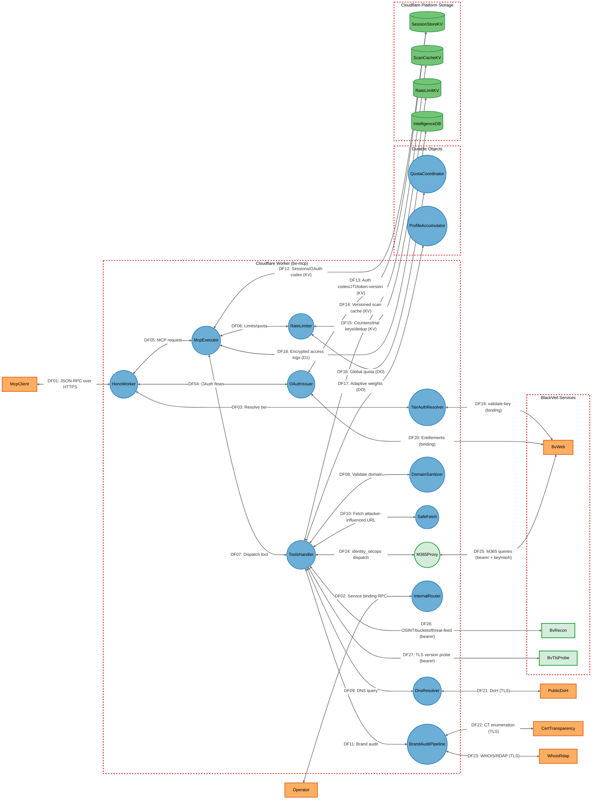
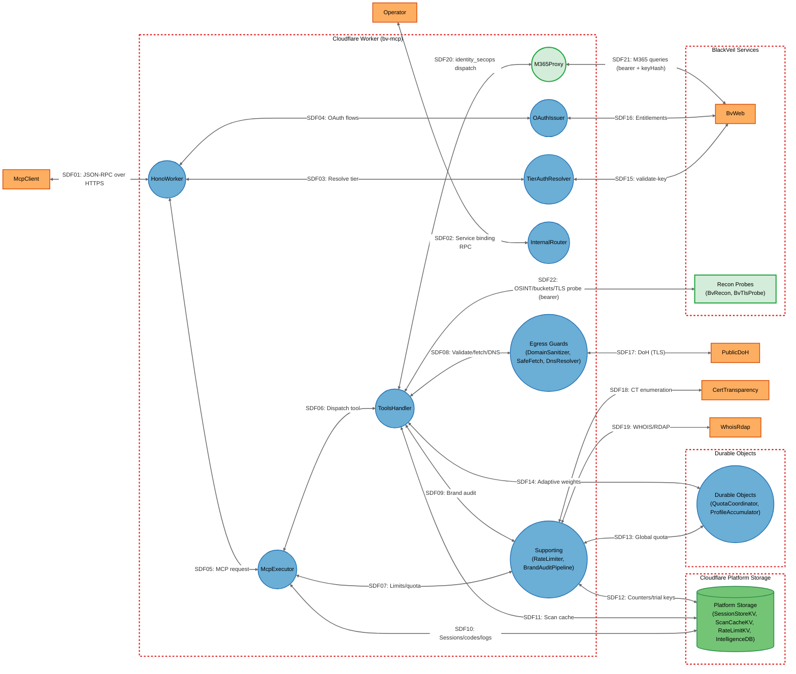

# Threat Model

## Data Flow Diagram

## Element Table

| Element | Type | TMT Category | Description | Trust Boundary | Status |
|---------|------|--------------|-------------|----------------|--------|
| McpClient | External Interactor | SE.EI.TMCore.WebApp | MCP client (LLM IDE/agent) calling `/mcp` | Internet | Unchanged |
| Operator | External Interactor | SE.EI.TMCore.User | BlackVeil operator (owner key / bv-web binding) | Internet | Unchanged |
| HonoWorker | Process | SE.P.TMCore.WebServer | Edge HTTP router; CORS/Origin, body-limit, routing, binding threading | CloudflareWorker | Modified |
| TierAuthResolver | Process | SE.P.TMCore.WebSvc | Caller tier resolution & authentication (dual dev keys, LKG cache, JWT keyHash) | CloudflareWorker | Modified |
| OAuthIssuer | Process | SE.P.TMCore.WebSvc | OAuth 2.1 issuer (JWT, PKCE, entitlements, `ver` revocation, TTL clamp) | CloudflareWorker | Modified |
| McpExecutor | Process | SE.P.TMCore.WebSvc | MCP pipeline: session, rate/quota, paid/auth tool gates, dispatch | CloudflareWorker | Modified |
| ToolsHandler | Process | SE.P.TMCore.WebSvc | Tool registry + execution (80 tools, request-dedup, versioned cache) | CloudflareWorker | Modified |
| M365Proxy | Process | SE.P.TMCore.WebSvc | Identity-secops proxy to bv-web internal M365 endpoints | CloudflareWorker | New |
| DomainSanitizer | Process | SE.P.TMCore.WebSvc | Domain input validation / SSRF input guard | CloudflareWorker | Modified |
| SafeFetch | Process | SE.P.TMCore.WebSvc | Egress SSRF guard for attacker-influenced URLs | CloudflareWorker | Unchanged |
| DnsResolver | Process | SE.P.TMCore.WebSvc | DoH egress (multi-resolver) | CloudflareWorker | Unchanged |
| RateLimiter | Process | SE.P.TMCore.WebSvc | Rate limits, quotas, distinct-domain cap, fuzzing detection | CloudflareWorker | Modified |
| InternalRouter | Process | SE.P.TMCore.WebSvc | Service-binding `/internal/*` surface (secure-by-default bearer, agent-chat allowlist) | CloudflareWorker | Modified |
| BrandAuditPipeline | Process | SE.P.TMCore.WebSvc | Brand-audit orchestration + cron/queue | CloudflareWorker | Unchanged |
| QuotaCoordinator | Process | SE.P.TMCore.WebSvc | Durable Object: cross-isolate quota coordination | DurableObjects | Unchanged |
| ProfileAccumulator | Process | SE.P.TMCore.WebSvc | Durable Object: adaptive-scoring persistence | DurableObjects | Unchanged |
| SessionStoreKV | Data Store | SE.DS.TMCore.NoSQL | KV: sessions, OAuth codes, JTI revocation, token-version counters | PlatformStorage | Unchanged |
| ScanCacheKV | Data Store | SE.DS.TMCore.Cache | KV: cached scan/check results under version-stamped keys | PlatformStorage | Modified |
| RateLimitKV | Data Store | SE.DS.TMCore.NoSQL | KV: rate/fuzzing counters, trial keys, distinct-domain markers, dedup records | PlatformStorage | Modified |
| IntelligenceDB | Data Store | SE.DS.TMCore.SQL | D1: access logs with AES-GCM-encrypted IP evidence, 90-day retention job | PlatformStorage | Modified |
| BvWeb | External Interactor | SE.EI.TMCore.WebSvc | Sibling worker: validate-key, OAuth entitlements, internal M365 proxy | BlackVeilServices | Modified |
| BvRecon | External Interactor | SE.EI.TMCore.WebSvc | Operator-only bv-recon worker: OSINT/buckets/threat feed (bearer-authenticated) | BlackVeilServices | New |
| BvTlsProbe | External Interactor | SE.EI.TMCore.WebSvc | Operator-only bv-tls-probe worker: TLS version handshakes (bearer-authenticated) | BlackVeilServices | New |
| PublicDoH | External Interactor | SE.EI.TMCore.WebSvc | Public DoH resolvers (Cloudflare/Google) | Internet | Unchanged |
| CertTransparency | External Interactor | SE.EI.TMCore.WebSvc | CT-log enumeration (certstream/crt.sh) | Internet | Unchanged |
| WhoisRdap | External Interactor | SE.EI.TMCore.WebSvc | WHOIS/RDAP registration lookups (+ registry RDAP allowlist for lookalike enrichment) | Internet | Unchanged |

## Data Flow Table

| ID | Source | Target | Protocol | Description | Status |
|----|--------|--------|----------|-------------|--------|
| DF01 | McpClient | HonoWorker | HTTPS (JSON-RPC) | MCP requests over Streamable HTTP | Unchanged |
| DF02 | Operator | InternalRouter | Service binding RPC | Internal tool/grant/trial-key/tenant calls | Modified |
| DF03 | HonoWorker | TierAuthResolver | In-process | Resolve caller tier from token/key | Unchanged |
| DF04 | HonoWorker | OAuthIssuer | In-process | OAuth register/authorize/token flows | Unchanged |
| DF05 | HonoWorker | McpExecutor | In-process | Validated JSON-RPC dispatch | Unchanged |
| DF06 | McpExecutor | RateLimiter | In-process | Apply per-IP/per-tool/global/distinct-domain limits | Modified |
| DF07 | McpExecutor | ToolsHandler | In-process | Dispatch tools/call (with keyHash principal) | Modified |
| DF08 | ToolsHandler | DomainSanitizer | In-process | Validate/sanitize domain input | Unchanged |
| DF09 | ToolsHandler | DnsResolver | In-process | Issue DNS record queries | Unchanged |
| DF10 | ToolsHandler | SafeFetch | In-process | Fetch attacker-influenced URLs (BIMI/redirects) | Unchanged |
| DF11 | ToolsHandler | BrandAuditPipeline | In-process | Run brand audit | Unchanged |
| DF12 | McpExecutor | SessionStoreKV | KV API (TLS) | Read/write sessions and OAuth codes | Unchanged |
| DF13 | OAuthIssuer | SessionStoreKV | KV API (TLS) | Store auth codes / JTI revocation / token-version counters | Modified |
| DF14 | ToolsHandler | ScanCacheKV | KV API (TLS) | Read/write cached results under version-stamped keys | Modified |
| DF15 | RateLimiter | RateLimitKV | KV API (TLS) | Read/write counters, trial keys, distinct-domain markers, dedup records | Modified |
| DF16 | RateLimiter | QuotaCoordinator | DO RPC | Global daily quota coordination | Unchanged |
| DF17 | ToolsHandler | ProfileAccumulator | DO RPC | Adaptive scoring weights | Unchanged |
| DF18 | McpExecutor | IntelligenceDB | D1 (TLS) | Write encrypted access-log evidence (90-day retention) | Modified |
| DF19 | TierAuthResolver | BvWeb | Service binding RPC | validate-key tier resolution (with LKG fallback) | Modified |
| DF20 | OAuthIssuer | BvWeb | Service binding RPC | Plan-to-tier entitlement lookup (with entitlement window) | Modified |
| DF21 | DnsResolver | PublicDoH | HTTPS (DoH) | DNS-over-HTTPS queries | Unchanged |
| DF22 | BrandAuditPipeline | CertTransparency | HTTPS | CT-log SAN/subdomain enumeration | Unchanged |
| DF23 | BrandAuditPipeline | WhoisRdap | HTTPS | Registration/ownership lookups | Unchanged |
| DF24 | ToolsHandler | M365Proxy | In-process | Dispatch identity_secops tools with keyHash principal | New |
| DF25 | M365Proxy | BvWeb | Service binding RPC | M365 sign-in/UAL/CA queries (internal bearer + keyHash) | New |
| DF26 | ToolsHandler | BvRecon | Service binding RPC | OSINT investigations, bucket scans, threat feed (bearer) | New |
| DF27 | ToolsHandler | BvTlsProbe | Service binding RPC | TLS version probe for check_ssl (bearer) | New |

## Trust Boundary Table

| Boundary | Description | Contains |
|----------|-------------|----------|
| Internet | Public internet — untrusted external actors and third-party services reachable over TLS | McpClient, Operator, PublicDoH, CertTransparency, WhoisRdap |
| CloudflareWorker | The bv-mcp Worker isolate at the Cloudflare edge; all request-path logic runs here | HonoWorker, TierAuthResolver, OAuthIssuer, McpExecutor, ToolsHandler, M365Proxy, DomainSanitizer, SafeFetch, DnsResolver, RateLimiter, InternalRouter, BrandAuditPipeline |
| DurableObjects | Cloudflare Durable Objects — stateful single-instance coordinators reachable only via in-account bindings | QuotaCoordinator, ProfileAccumulator |
| PlatformStorage | Cloudflare-managed KV/D1 stores reachable only via in-account bindings (no network listeners) | SessionStoreKV, ScanCacheKV, RateLimitKV, IntelligenceDB |
| BlackVeilServices | Sibling BlackVeil workers reachable via authenticated service bindings | BvWeb, BvRecon, BvTlsProbe |

## Summary View

## Summary to Detailed Mapping

| Summary Element | Contains | Summary Flows | Maps to Detailed Flows |
|-----------------|----------|---------------|------------------------|
| EgressGuards | DomainSanitizer, SafeFetch, DnsResolver | SDF08, SDF17 | DF08, DF09, DF10, DF21 |
| SupportingServices | RateLimiter, BrandAuditPipeline | SDF07, SDF09, SDF12, SDF13, SDF18, SDF19 | DF06, DF11, DF15, DF16, DF22, DF23 |
| DurableObjectsGroup | QuotaCoordinator, ProfileAccumulator | SDF13, SDF14 | DF16, DF17 |
| PlatformStorageGroup | SessionStoreKV, ScanCacheKV, RateLimitKV, IntelligenceDB | SDF10, SDF11, SDF12 | DF12, DF13, DF14, DF15, DF18 |
| ReconProbes | BvRecon, BvTlsProbe | SDF22 | DF26, DF27 |
| HonoWorker | HonoWorker | SDF01, SDF03, SDF04, SDF05 | DF01, DF03, DF04, DF05 |
| McpExecutor | McpExecutor | SDF05, SDF06, SDF07, SDF10 | DF05, DF06, DF07, DF12, DF18 |
| ToolsHandler | ToolsHandler | SDF06, SDF08, SDF09, SDF11, SDF14, SDF20, SDF22 | DF07, DF08, DF09, DF10, DF11, DF14, DF17, DF24, DF26, DF27 |
| M365Proxy | M365Proxy | SDF20, SDF21 | DF24, DF25 |
| TierAuthResolver | TierAuthResolver | SDF03, SDF15 | DF03, DF19 |
| OAuthIssuer | OAuthIssuer | SDF04, SDF16 | DF04, DF13, DF20 |
| InternalRouter | InternalRouter | SDF02 | DF02 |
