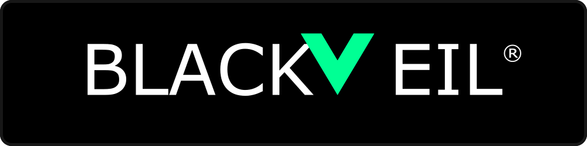

  

    
  

  

    <strong>BRAND DISCOVERY & SHADOW IT</strong> 
    TARGET: HOMEDEPOT.COM 
    DATE: MAY 11, 2026 
    PREPARED BY: BLACKVEIL DNS ENTERPRISE SERVICES
  

## Executive Summary
This report details the findings of an automated brand discovery and infrastructure correlation scan performed against the `homedepot.com` seed domain. The objective of this scan is to map the organization's decentralized domain portfolio, identify "Shadow IT" (legitimate domains managed outside of the primary corporate registrar), and distinguish these from unauthorized impersonation threats.

## 1. Primary Corporate Infrastructure
The following domains were identified as part of the core corporate portfolio, correctly consolidated under the primary enterprise registrar (**Unknown**).

| Domain | Infrastructure Signals | Verified Registrar | Status |
| :--- | :--- | :--- | :--- |
| **homedepot.com** | Primary Seed | Unknown | ✅ Consolidated |
| *No additional consolidated domains found* | - | - | - |

---

## 2. Discovered Shadow IT / Vendor Sprawl
The Blackveil engine successfully correlated the following domains to homedepot.com's infrastructure (via shared cryptographic keys, DMARC reporting endpoints, and custom nameserver pools). However, WHOIS analysis reveals these domains are registered at a **competing registrar**, indicating portfolio fragmentation and vendor sprawl.

*These represent immediate consolidation opportunities for the primary registrar.*

| Discovered Domain | Correlation Evidence | Verified Registrar | Status |
| :--- | :--- | :--- | :--- |
| **emaildefense.proofpoint.com** | DMARC RUA Match | Unknown | 🟡 Consolidation Target |

---

## 3. High-Risk Impersonation Threats
During the analysis, external domains exhibiting high visual similarity (lookalikes) or low confidence signal overlaps were evaluated against the infrastructure correlation engine. The following domains are registered at consumer-grade registrars or exhibit no strong shared infrastructure with homedepot.com, indicating they are unauthorized and potentially adversarial.

| Threat Domain | Discrepancy Evidence | Verified Registrar | Status |
| :--- | :--- | :--- | :--- |
| *No high-risk impersonation domains found* | - | - | - |

---

## 4. Revenue & Consolidation Opportunity

Based on the discovery of 1 high-value Shadow IT domains, the following is a projection of the immediate revenue opportunity for the primary registrar to consolidate and secure this fragmented infrastructure.

  <h3>Estimated Annual Recurring Revenue (ARR) Gain</h3>
  <table style="margin-top: 10px;">
    <tr>
      <th>Service Line</th>
      <th>Unit Economics</th>
      <th>Opportunity Value</th>
    </tr>
    <tr>
      <td><strong>Domain Transfer & Renewals</strong></td>
      <td>1 domains @ $150/yr (Enterprise Tier)</td>
      <td><strong>$150 / yr</strong></td>
    </tr>
    <tr>
      <td><strong>Managed Premium DNS</strong></td>
      <td>1 domains @ $2,000/yr (UltraDNS SLA match)</td>
      <td><strong>$2,000 / yr</strong></td>
    </tr>
    <tr>
      <td><strong>Advanced Security Monitoring (Blackveil)</strong></td>
      <td>1 domains @ $1,200/yr (Continuous Auditing)</td>
      <td><strong>$1,200 / yr</strong></td>
    </tr>
    <tr>
      <td colspan="2" style="text-align: right; font-weight: bold; font-size: 16px;">Total Identified ARR Opportunity:</td>
      <td style="font-weight: bold; font-size: 16px; color: oklch(0.87 0.29 155);">$3,350 / yr</td>
    </tr>
  </table>
  
<em>* Note: This represents the opportunity from a single discovery run on a small subset of candidate domains. A full portfolio scan typically yields 10x-50x more candidates.</em>

## Strategic Recommendations
1. **Portfolio Consolidation:** Present the cryptographic evidence to the homedepot.com security team to initiate transfer procedures for the 1 identified domains currently managed by competing registrars, bringing them under the primary master agreement.
2. **Defensive Action:** Forward the details of the unauthorized lookalike domains to the brand protection and legal teams for immediate takedown or UDRP proceedings.
3. **Continuous Monitoring:** Enroll the newly discovered Shadow IT domains into the Blackveil automated security scanning tier to ensure compliance with corporate baseline policies (DMARC, DNSSEC, etc.).

***
*Generated automatically by the Blackveil DNS Multi-Tenant Orchestrator. Powered by Blackveil Security.*

